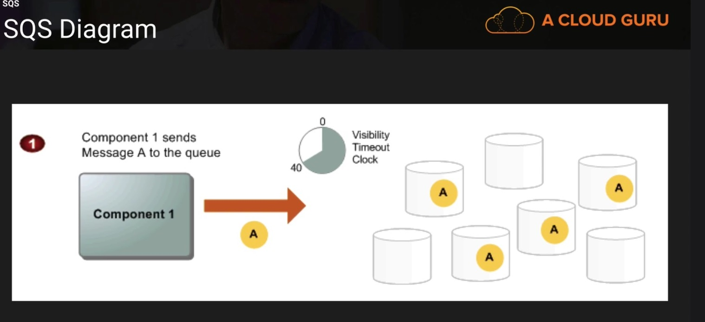
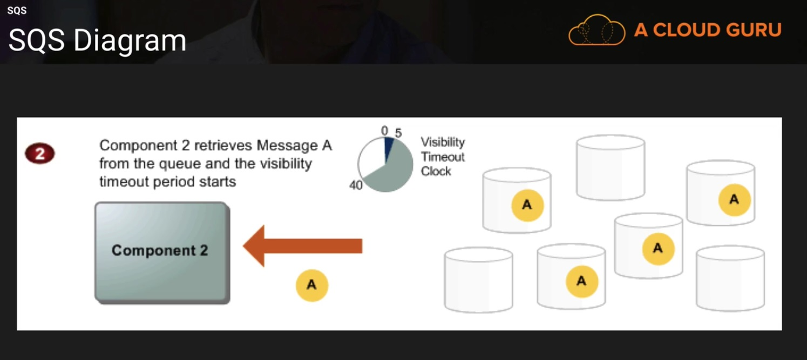
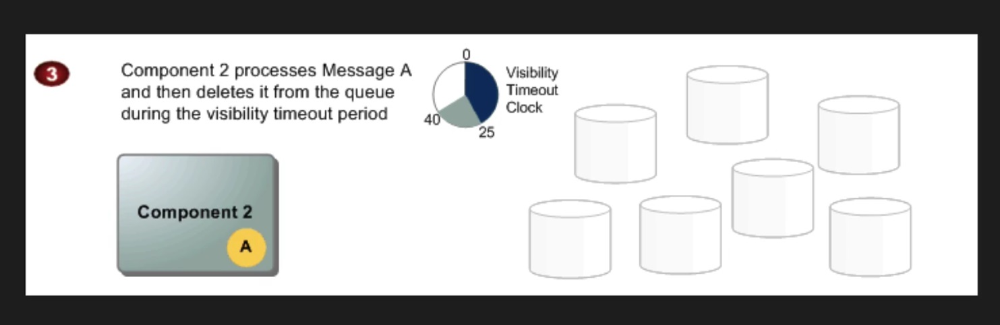
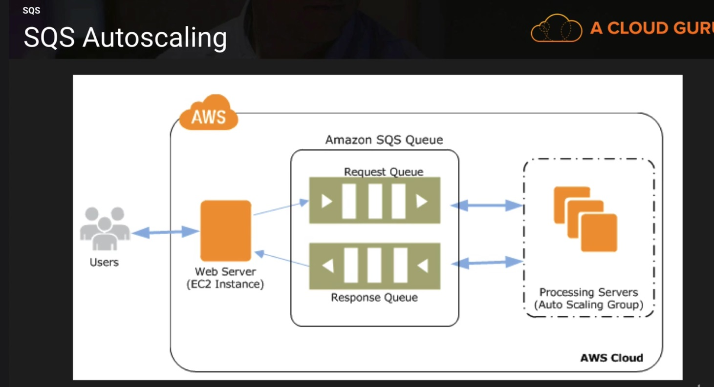

# AWS Applications

## Section 9, Lecture 74 (SQS)

* It is the first service that AWS released. It is older than EC2

SQS is a web service that gives you access to message queue that can be used to store messages while waiting for a computer to process them.
Amazon SQS is a distributed queue system then enables web service applications to quickly and reliably queue messages that one component 
in the application generates to be consumed by the other component. A Queue is a temporary for messages that are awaiting processing.
This way you can decouple your infrastructure.

Using Amazon SQS you can decouple the components of an application so they run independently, with Amazon SQS easing message management 
between components. Any component of a distributed application can store messages in a fail-safe Queue. Messages can contain upto 256KB of 
text in any format. Any message can then retrieve the messages programatically using the Amazon SQS API.

The queue acts as a buffer between the component producting and saving data, and the component receiving the data for processing. 
This means that the queue resolves issues that arise if the producer is producing work faster than the consumer can process it, or if the 
producer or consumer are only intermittently connected to the network.

Amazon SQS ensured delivery of each message atleast once, and supports multiple readers and writers interacting with the same queue.
A single queue can be used simultaneously by many distributed application components, with no need for those components to co ordinate with 
each other to share the queue.

Amazon SQS is engineered to always be available and deliver messages. One of the resulting tradeoffs is that SQS doesn't gaurantee 
first in first out delivery of messages. For many distributed applications each message can stand on its own, and as long as all messages 
are delivered, the order is not important. If your system requires that the order be preserved, you can place sequencing information in 
each message, so that you can re order the messages when the queue returns them.

SQS only allows pull mechaism, the messages are never pushed out. 

SQS has a concept called visibility timeout. The component responsible (Component 1) for producing the message puts the message (message A)
in the queue with a visibility timeout of say 40s. The component (Component 2) responsible for processing the queue keeps on polling 
the queue and picks the message (message A) from the queue whenever available for processing and the visibility timeout period starts.
Component 2 processes message A and then deletes it from the queue during the visibility timeout period. If due to some reason (say instance failure) 
the component 2 is unable to process the message during the visibility timeout window then the other component 3 would poll the queue 
and see that the message has expired. Component 3 will assume that there was a failure and will pick the message up for processing. The 
message is deleted from the message queue only when its complete.

SQS in action 

 * SQS Autoscaling:
 
 SQS can also autoscale, If the queue is expanding beyond limit you can configure EC2 autoscaling to deal with the queue size, 
 Any of the meme websites would be using it. Suppose that a meme goes viral and every one is flooding on your website to generate different
 kids of sayings on it. your application servers will see that a queue is growing very fast and then autoscale to bring the size down.
 It is the backbone of some of the prowerful websites like netflix and reddit.
 
 

 
 * SQS exam tips:
  * Does not offer fifo
  * 12 hour visibility timeout window by default
  * Amazon SQS is engineered to provide "at least once" delivery of all messages in its queues. Although most of the time 
  each message will be delivered to your application exactly once, you should design your system so that processing a message more than
  once doesn't create any errors or inconsistencies. 
  * 256 Kb message size now available
  * Billed at 64 kb "chunks"
  * First 1 million Amazon SQS requests per month are free
  * $0.50 per 1 million Amazon SQS requests per month thereafter.
  * A single request can have from 1 to 10 messages, up to a maximum total payload of 256KB
  * Each 64 kb chunk is billed as one request. For eg. a single api call with a 256 kb payload will be billed as four requests.

* Recmmended Reading FAQ's

## Section 9, Lecture 75 (SWF - Simple workflow service)

Amazons Simple workflow service (Amazon SWF) is a web service that makes it easy to co-ordinate work across different application components. Amazon SWF enables applications for a range of use cases including media processing, web application backends, business process workflows and analytics pipelines, to be designed as a co-ordination of tasks. Tasks represent invocation of various processing steps in an application which can be performed by executable code, web service calls, human actions and scripts.

Amazon website uses Amazon SWF to cordinate tasks from placing of order to the delivery of package.

* SQS vs SWF
 * SQS has retention period of 14 days, SWF up to 1 year for workflow executions.
 * Amazon SWF provides a task oriented API, whereas SQS provides a message oriented api.
 * Amazon SWF ensures that a task is assigned only once and  never duplicated. With Amazon SQS you need to handle duplicated messages   and may also need to ensure that a task is processed only once.
 *  Amazon SWF keeps a track of all the tasks and events in an application. With Amazon SQS you need to implement your own application level tracking, especially of your application uses multiple queues.

* SWF Actors
 * Workflow Starters -  An application that can initiate a workflow. Could be your ecommerce website when placing an order or a mobile app searching for bus times.
 * Deciders - Control the flow of activity tasks in a workflow execution. If something has finished in a workflow (or fails) a decider decides what to do next.
 * Activity Workers - Carry out the activity tasks.
 
## Section 9, Lecture 76 (SNS - Simple Notification Service)

Amazon simple notification service is a web service that makes it easy to setup operate and send notifications from the cloud.

Beside pushing notifications to mobile devices, Amazon SNS deliver messages through SMS text message, email, to amazon SQS ques or to any HTTP endpoint. SNS notifications can also trigger lambda functions. When a messages is pushed to an SNS topic that has a lambda function subscribed to it, the lambda function is invoked with the payload of the published message. The lambda function received the payload as an input parameter and can manipulate the information in the message, publish the message to other SNS topics, or send the message to other AWS devices.

SNS allows you to group multiple recipients using topics. A topic is an "access point" for allowing recipients to dynamically subscribe for identical copies of the same notification. One topic can support delivery to multiple endpoint types -- for example, you can group together IOS, Android and SMS recipients. When you publish once to a topic, SNS delivers appropriately formatted copies of your message to each subscriber.

SNS Benefits
* Instantaneous push based delivery (no polling)
* Flexible message delivery over multiple transport protocols.
* Inexpensive pay as you go model with no upfront cost.

SNS Pricing
* Users pay $0.50 per 1 million SNS requests
* $0.06 per 100,000 Notification delivery over http
* $0.75 per 100 notification deliveries over SMS
* $2.00 per 100,000 notification deliveries over email.

## Section 9, Lecture 77 (Elastic Transcoder)

Its a media transcoder in the cloud. It allows you to convert media files from their original source format in to different formats that will play on smartphones, tablets, pcs etc. Provides transcoding presets for popular ourput formats, which means that you don't need to guess which settings works best on particular devices. Pay based on minutes that you transcode and resolution at which you transcode 

## Section 9, Lecture 78 (Application Services Summary)

* Read SQS FAQ's
* SNS Subscribers
 * Email
 * HTTP
 * HTTPS
 * Lambda
 * EMAIL - JSON
 * Application
 * SQS
* SNS is push based, SQS is polled

