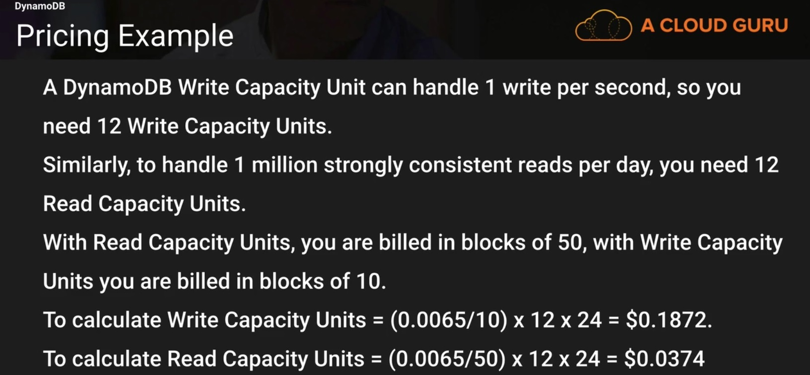

# Databases

## Section 7 Lecture 56 (Databases 101)

### Relational Database Types
* SQL Server
* Oracle
* Mysql
* Mariadb
* Aurora
* PostgreSQL

### Non relational Database Types
* Dynamo DB
  How it stores data?
  * Database
   * Collection
    * Documents
     * Key Value Pairs
  
### What is data warehousing?
Used for business intelligence. Tools like cognos, jaspersoft, sql server reporting services, Oracle Hyperion, SAP Netviewer.

Used to pull in very large and complex data sets. Usually used by management to do queries on Data (such as current performance vs targets etc.)

#### OLTP Vs OLAP
Online Transaction processing differes from Online Analytics Processing in terms of types of queries run.

##### OLTP Example:
Order number 2120121
Pulls up a row of data such as name, date, Address to deliver to,Delivery Status etc.

##### OLAP Transaction Example:
Net profit for EMEA and Pacific for digital Radio Product.
- Pulls in large number of records
* Sum of Radios Sold in EMEA
* Sum of Radios sold in Pacific
* Unit cost or Radio in each region
* Sales price of each radio
* Sales price - unit cost

Data Warehousing databases use different type of architecture both from a database perspective and infrstructure layer.
So if the OLAP queries are run on a current production database which also runs OLTP eg where customers place orders 
then it would hurt the user exerience by affection the database I/O. Hence an OLAP database could be more or less a 
copy of production database where analytics could be run. An example of database for OLAP processing could used columnar storage, 
Redshift(check). When we use columnar storage we can improve performance time for OLAP (Read in detail).

### What is elastic cache?
Elastic cache is a web service that makes it easy to deploy operate, and scale an in memory cache in th cloud. 
The service improves performance of the web applications by allowing you to retrieve information from the fast, managed, 
in memory cashes instead of relying entrely on slow disk based databases.
ElastiCache supports two open source in memory caching engines
* Memcached
* Redis

### What is DMS?
DMS stands for database Migration Service. Allows you to migrate your production database to AWS. Once the migration has started, 
AWS handles all the complexities of the migration process like data type transformation, compression and parallel transfer 
(for faster data transfer) while ensuring that data changes to the source database that occur during the migration process are 
automatically replicated to the target.

AWS schema conversion tool automatically converts the source database schema and the majority of custom code, including views, 
custom code, stored procedures and functions to a format compatible with the target database.

## Section 7 Lecture 57 (Launching an RDS instance)
Basic connection to database tutorial with security group enhancements.

## Section 7 Lecture 58 (RDS - Backups, Multi-AZ & Read Replicas)

### Encryption

* Encryption is done using AWS key management service (KMS). Once your RDS instance is encrypted the data stored at rest in the underlying storage is encrypted, as are its automated backups, read replicas and snapshots.
* At present encryption on an existing database is not supported. To enable encryption you should enable it during DB creation and then import data to it.

### Backups (Snapshots vs Automated Backups)

* DB snapshots are done manually(i.e they are user initiated). They are stored even after you delete the original RDS instance unlike automated backups.
* Automated backup data is stored in S3 and you get free storage space equal to the size of your database volume.
* RDS provides point in time recovery. If automated backups are enabled it takes a full snapshot of the volume during the scheduled time and stores it on S3. Apart from this transaction logs throught the day are also stored on S3. Which means if you want to restore a database to just 5 mins back of data you aws will be first restoring full snapshot of a relevant day then applying transaction logs for point in time restore to the desired time.

### Multi A-Z

* Multi AZ RDS allows you to have a copy of your production database into other availability zone. This is a standby instance, incase of zone failure or instance failure, aws RDS will automatically failover to standby instance so that the database operations can resume quickly without administrative intervention. Multi AZ is for disaster Recovery only it is not exposed for use.

### Read Replicas

* Read replica Databases
  * Used for Scaling!!! Not for DR!
  * Must have automated backups turned on on the master in order to deploy a read replica
  * Replication happens asynchronously
  * You can have upto 5 read replica copies of any databases
  * You can have read replica of a read replica (But watch out for latency)
  * Each read replica will have its own DNS endpoint
  * You cannot have read replicas as Multi A-Z
  * Read Replicas can be promoted to be their own databases
  * Read Replica in a second region for MySQL and MariaDB. Not for PostgreSQL
 
 * Dynamo DB vs RDS
 DynamoDB offers push button scaling, mean that you can scale your database on the fly, without any downtime
 
 RDS is not so easy and you usually have to use a bigger instance size or to add a read replica. And involves downtime.

## Section 7, Lecture 59 (Dynamo DB)

What is DynamoDB?
Dynamodb is fast and flexible nosql database service for all applications that need consistent, single digit millisecond latency at any scale. It is a fully managed database and supports both key-value and document data models. Its flexible performance and reliable performance make it a great fit for gaming, mobile, web, ad-tech, IOT and many other applications.

* Stored on SSD Storage
* Spread Across 3 geographically distinct data centres. 3 different Facilities
* As it is spread across three different facilities, it means it has different consistency models
  * Eventual Consistent Reads (Default)
  * Strongly Consistent Reads
 
  - Eventual Consistent Reads: Consistency across all copies of data is usually reached within a second. Repeating a read after a short time should return updated data(Best Read Performance)
  - Strongly Consistent Reads: A strongly consistent read returns a result that reflects all writes that received a successful response prior to the read.
 
 You should choose one of these models very carefully, if your application needs immediate reponse after performing a write say in 1/2 a second you can use strongly consistent reads, if it can wait for a second wherein the data is written across all the failities and then the data is avialable for read say in a second you could choose eventual consistent reads.
 
 * Dynamodb pricing:
 Provisioned throughput capacity
  * Write throughput $0.0065 per hour for every 10 units.
  * Read throughput $0.0065 per hour for every 50 units.
  * Storage cost of $0.25GB per month.
  
  
   
   Dynamod DB can be very expensive for writes but is very cheap for reads. So if you have a scenario where you need lots of reads and few writes and you need it to be very very scalable with really good performance and you do not need to SQL join queries which means it can run on a no sql database, then you might want to look at dynamodb as opposed to rds.
   
   
   Most important aspect of Dynamodb is it is really really easy to scale and is called push button scaling and doesn't need a downtime as could be in the case of RDS. You just have to increase the Read and write capacity units and click save. In case of RDS you might have to create a read replica, adjust the instance size and then promote to master. Also in RDS you can exhaust your read replica level or there's a maximum instance size limit till which you can scale. So with RDS it is harder to scale. 

## Section 7, Lecture 60 (RedShift)

Amazons Datawarehousing service Redshift. Amazon Redshift is a fast and powerful, fully managed, petabyte scale data wareshouse service in the cloud. Customers can start small for just $0.25 per hour with no commitments or upfront costs and scale to petabyte or more for $1000 per terabyte per year, less than a tenth of most other warehousing solutions.

- Redshift Configuration
 * Single node : With Redshift you can start with a single node which can store upto 160 GB of data.
 * Multi node: Incase you need to scale, the configuration has a leader node and multiple compute nodes.
  * Leader Node: manages client connections and receives queires
  * Compute Node: Store data and perform queries and computations. You can provision upto 128 compute nodes.
  You can be a huge multinational like Toyota where a large amount of data querying would be involved and you would need to have a multinode architecture.
  
- Redshift 10 times faster
 * Columnar Data Storage: Instead of storing data as a series of rows, Amazon Redshift organizes the data by column. Unlike row based systems which are ideal for transaction processing, column based systems are ideal for datawarehousing and analytics, where queries often involve aggregates performed over large data sets. Since columns involved in queries are processed and columnar data is stored sequentially on the storage media, column based data require far few I/Os, greatly improving query performance.
 * Advanced Compression: Columnar data stores can be compressed much more than row based data stores because similar data is stored sequentially on disk. Amazon redshift employs multiple compression techniques and can achieve significant compression relative to traditional relational data stores. In addition Amazon Redshift doesn't require indexes or materialized views and so use less space than traditional relational database systems. When loading data into an empty table, Amazon Redshift automatically samples your data and selects the most appropriate compression scheme.
 * Massively Parallel Processing (MPP): Amazon Redshift automatically distributes data and query load across all the nodes. Amazon Redshift makes it easy to add nodes to your datawareshouse and enables you to maintain fast query performance as your data warehouse grows.
 
- Redshift Security
 * Everything that is comunicated to redshift is encrypted in transit using SSL
 * It is also encrypted at rest using AES-256 encryption
 * By default redshit takes care of Key Management
  * However you can manage your own keys through HSM(Hardware security modules)
  * You can also manage your own keys using AWS Key Management Service.

- Redshift Availability
 * Currently available only in 1 AZ
 * Can restore Snapshots to new AZ's in the event of an Outage.

## Section 7, Lecture 61 (Elasticache)

Elasticache is a web service that makes it easy to deploy operate and scale an in memory cache in the cloud. The service improves the performance of web applications by allowing them to retrieve information from fast managed in-memory caches, instead of relying on slower disk based databases. 

Amazon elastiCache can be used to significantly reduce latency and improve throughput for many read heavy application workloads (such as social networking, gaming, media sharing and Q & A portals) or compute intensive workloads (such as recommendation engine).
Caching improves application performance by storing critical pieces of data in memory for low latency access. Cached information may include the results of I/O intensive database queries or the results of computationally intensive calculations.

Types of Elastic Cache
* Memecached
* Redis
 * An opensource in-memory key value store that supports data structures such as sorted sets and lists. Elastic cache supports master slave replication and multi AZ which can be used to achieve cross AZ redundancy. This is not available with memcached.
 
 Elasticache is a good choice if your database is particularly read heavy and not prone to frequent changing.
 Redshift is a good answer if the reason your database is feeling stress is because management keeps running OLAP transactions on it etc.
 
## Section 7, Lecture 62 (Aurora)

What is Aurora?
Aurora is a MYSQL-compatible, relational database engine that combines the speed and availability of high end commercial databases with the simplicity and cost-effectiveness of open source databases. Amazon Aurora provides upto 5 times better performance than MYSQL at a prices point one tenth that of a commercial database while delivering similar performance and availability. Aurora is a part of RDS.

It was launched in Reinvent 2014 and was considered to be a competion to oracle. The advantage of Aurora is that it will cost you a fraction of cost of oracle.

Advantages of Aurora:
* Starts with 10 GB, scales in 10GB increments to 64 TB (Storage Autoscaling).
* Compute Resources can also scale up to 32v CPUS and 244 GB of RAM.

- Aurora Scaling:
 * 2 copies of data is contained in each avialibility zone with minimum of 3 availability zones. Which means 6 copies of data.
 * Aurora is designed to handle loss of upto 2 copies of data without affecting database write avialability and upto 3 copies of data without affecting read availability.
 * Aurora storage is also self healing. Data blocks and disks are continously scanned for errors and rapaired automatically.
 
- Aurora Replicas:
 * 2 Types of replicas are available.
 * Aurora Replicas (currently 15)
 * Mysql Read Replicas (Currently 5)
 
 The difference between Aurora and Mysql read replica is that if your primary database fails, it will automatically switch over to an Aurora replica however it isn't true if you create a mysql replica.
 
 In aurora you have an option where you can select tiers while provisioning a database. Tier 0 has the hightest priority and decreases as the number increases. So when you provision an aurora master database select the tier as 0. You donot need to make it multi AZ. While provisioning an aurora read replica select tier 1 and privison it in a zone different than master. In case of a zone failure the master would automatically failover to the replica with the second hightest priority. In this case you can save on the multi AZ cost. Also the master has a cluster cname while a read replica would have a cname containing read replica. When the failover happens the read reaplica will automatically take up the cluster cname, so you donot have to modify strings in your code. Aurora master has the Replication role as writer while the read replica has the role of reader. 

## Section 7, Lecture 63 (Databases Summary)

Already Known. Go through AWS RDS FQA's

[FAQS](faqs/aws-rds-faqs.md)
