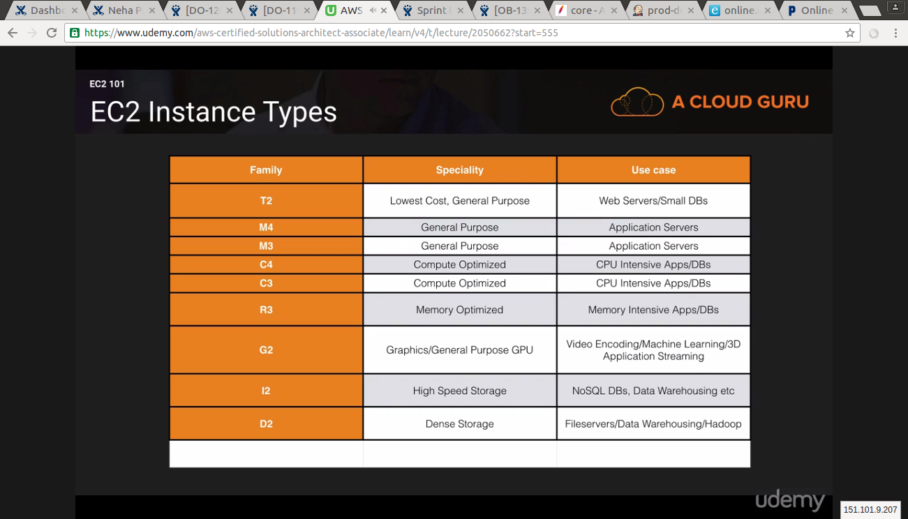
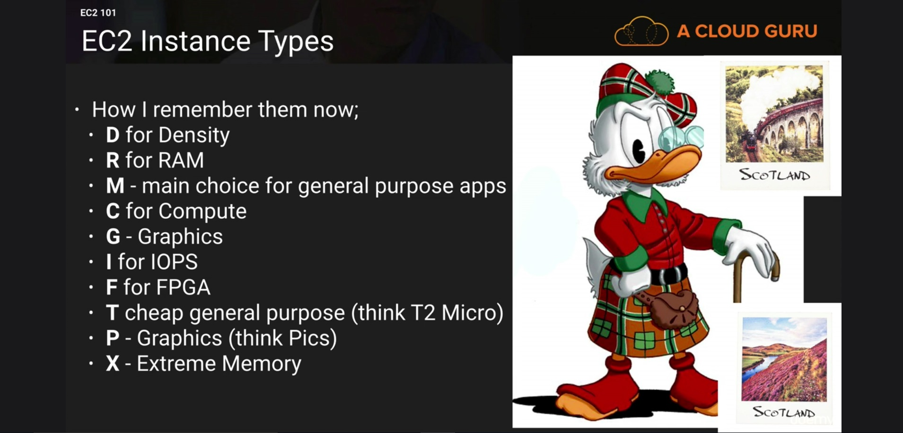
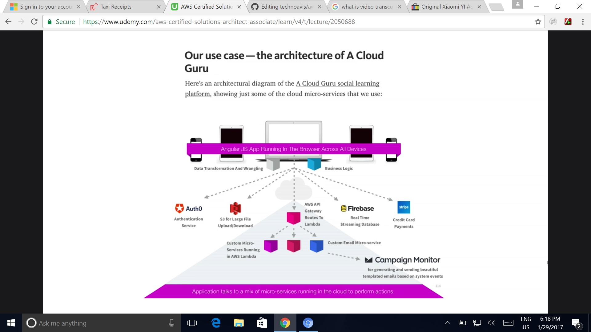
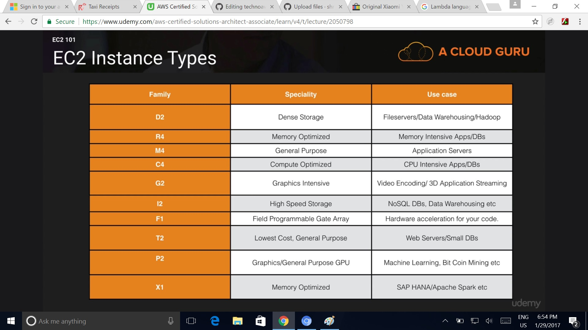
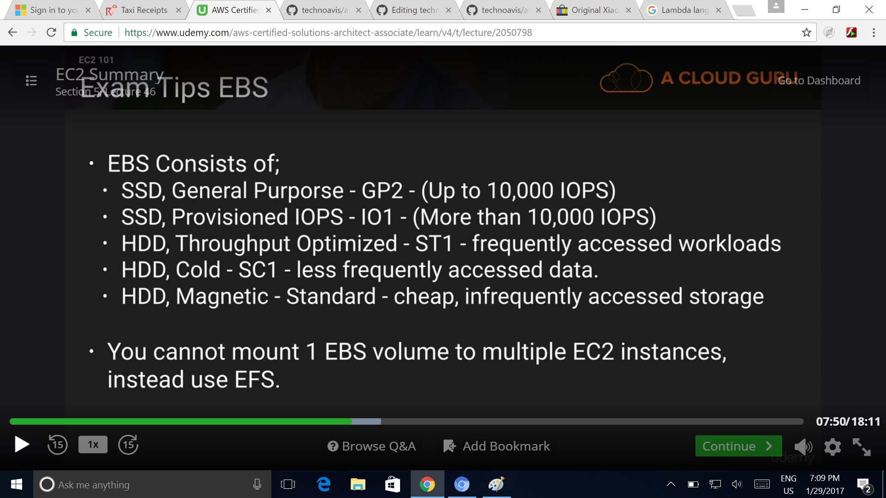
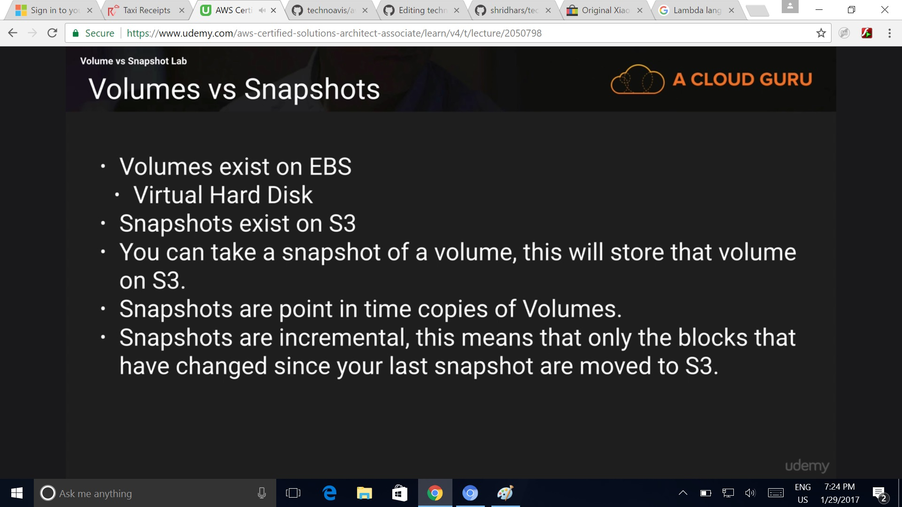
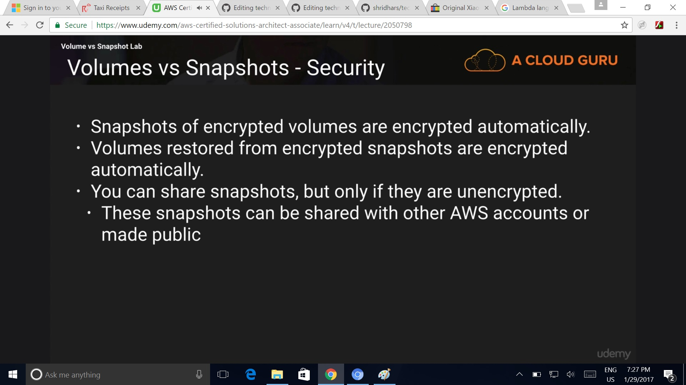
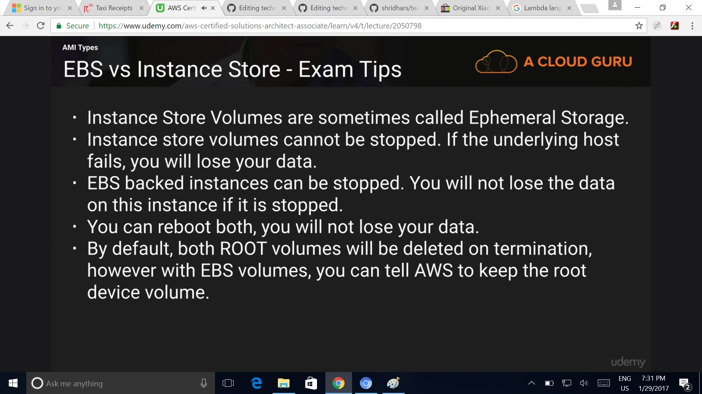

# EC2

## Section 5 Lecture 26 (EC2 101)

* Amazon Elastic compute cloud is a web service that provides resizeable compute capacity in the cloud. EC2 reduces the time required to obtain and boot new server instance to minutes, allowing you to quickly scale capacity up and down, as your computing requirements change.

* EC2 Options :
  * On Demand : Allows you to fix rate per hour with no commitments.
   Use Case - To be used where you do not want to pay upfront or make a long term commitment. Applications with short term spiky or unpredictable workloads that cannot be interrupted. These can be your dev or test environments or applications that are being tested on the AWS for the first time.
   A scenario could be where we need to suppliment our reserved instances say for 24-72 hours. An example could be a Black friday and Cyber Monday sale coming up where you know there could be 200% rise in traffic and you need additonal capacity for those 72 hours to cater to the additonal load. Once the sale is over you go ahead and terminate the instances.

  * Reserved : Provides you with a capacity reservation, and offers a significant discount on the hourly charge for an instance. 1 Year or 3 Year Terms
   Use Case -  Where applications have a steady state, reserved instances can be used. 
  * Spot Instances : Enables you to bid what ever price you want for the Instance capacity, providing for even grater savings if your applications have flexible start and end times.
   Use Case - Genomics or research companies use sopt instances to do a large amount of compute in short amount of time. If you are asked what is commercially feasible always go for spot instanes.
   If a spot instance is terminated by Amazon EC2, you will not be charged for partial hour of usage. However if you terminate the instance by yourself you will be charged for the hour in which the instance ran.

### EC2 instance types

Remember DIRTMCG (D for Density, I for IOPS, R for RAM, T - Cheap general purpose T2 Micro, M- Main choice for general purpose apps, C for compute, G for graphics)



### What is EBS

EBS can be thought of a simple disk. Disk on the cloud. You can have Operating systems, databases run on ebs(Block storage). Ebs volumes are placed in a specific availability zone, where they are automatically replicated to protect you from failure of a single component. EBS can only be attaced to one EC2 instance, so an EC2 instance can have multiple EBS attached but not vice versa. If you want to share a file system you can use EFS (Elastic File Storage) .

### EBS Volume Types

* General Purpose SSD (GP2)
  * Designed for 99.999% availability
  * Ratio of 3 IOPS per GB with up to 10,000 IOPS and the ability to burst up to 3000 IOPS for short periods, for volumes under 1 Gib
* Provisioned IOPS SSD (IO1)
  * Designed for I/O intensive applications such as large relational or NoSQL databases. Use if you need more than 10,000 IOPS.
* Magnetic (Standard)
  * Lowest cost per gigabyte of all EBS volume types. Magnetic volumes are ideal for workloads where data is accessed infrequently, and applications where the lowest storage cost is important. A use case could be file servers (Cheap infrequently accessed Storage).

### What is IOPS?

IOPS is simply, input output per seconds. It's simply how fast the disk is from both read and write perspective. More the IOPS you have, faster you can read and write to the disk.

## Section 5 Lecture 27 (EC2 101 Part 2)

What is an EBS?
Amazon EBS allows you to create storage volumes and attach them to Amazon EC2 instances. Once attached, you can create a file system on top of these volumes, run databases, or use them in any other way you could use a block device. Amazon EBS volumes are stored in a specific Availability Zone where they are automatically replicated to protect you from failure of a single component. Basically AWS has redundancy of disk arrays in place, it is not dependent on 1 plysical device. If a SAN goes down, it doesn't matter, as the redundancy is build in.

EBS Volume Types
* General Purpose SSD (GP2): They balance for price and performance. You get 3 IOPS per gig. So 100gb will give you a baseline performance of 300 IOPS. You can go upto 10,000 IOPS and you have to ability to burst upto 3000 IOPS for extended periods of time for volumes of under 1 Gib.
* Provisioned IOPS SSD (IO1): You need privisioned IOPS where the I/O requirement is more than 10,000 IOPS. They can be used for large Relational Database intensive workloads or  no sql databases. With privisioned IOPS SSD, you can now go upto 20,000 IOPS per volume.
* Throughput Optimized HDD (ST1) - Old school physical magnetic spinning disc: This is typically used for Big Data, Data warehousing, Log Processing where you have large amounts of sequential data as opposed to data that is non sequential, which is spread all over the disk. They cant be boot volumes.
* Cold HDD (SC1): Lowest Cost Storage for infrequently accessed workloads. eg It can be used as a file server. Again these cannot be boot volumes.
* Magnetic (Standard): This is the lowest cost per gigabyte of all EBS volumes that is bootable. Magnetic Volumes are ideal for workloads where data is accessed infrequently, and applications where lowest storage cost is important.

EC2 instance Types in Picture


 

## Section 5 Lecture 28 (Lets get our hands dirty! Launch an EC2 instance)

* On an EBS backed instance the default action is for the root EBS volume to be deleted when the instance is terminated.
* Root Volumes cannot be encrypted by default, you need a third party tool (such as bit locker etc) to encrypt the root volume.
* Additional Volumes can be encrypted.

### AMI (Amazon machine image): 
Its a pre baked Virtual Machine. It has different OSes baked into it eg. Linux, Redhat, SUSE, Ubuntu

## Section 5 Lecture 29 (How to use putty, Windows users only)

Putty doesn't support pem files it supports PPk files. So putty keygen converts pem into ppk files. Go to the putty site and download putty.exe and puttyygen.exe

## Section 5 Lecture 30 (Lets get our hands dirty! Launch an EC2 instance - Part 2)

* Termination protection is turned off by default you should turn it on.
* On an EBS backed instance the default action is for the root EBS volume to be deleted when the instance is terminated.
* EBS root volumes of your DEFAULT AMIs cannot be encrypted. AMI's provided by AWS cannot be encrypted. However you can also use a third party tool (such as bitlocker etc) to encrypt the root volume, or this can be done when creating AMIs in the AWS console or using API's. Additional volumes can definitely be encrypted. 

## Section 5 Lecture 31 (How to use Putty - Windows users only)

## Section 5 Lecture 32 (Security group basics)

Already Known

## Section 5 Lecture 33 (Create an amazon machine image)

* An AMI is the template of the root volume for the instance(for eg an operating system, an application server, and applications)
* A block device mapping that specifies the volumes to attach to the instance when it is launched.
* A volume snapshot is stored in S3
* AMI's are regional, you can only launch an AMI from the region in which it is stored.

## Section 5 Lecture 35 (AMI's - EBS root volumes vs Instance Store)

* Instance store volumes are sometimes called ephemeral Storage
* Instance store volumes cannot be stopped. If the underlying hosts fails you will lose data
* EBS backed instances cab be stopped, you will not lose data.
* You can reboot both, without losing any data.
* By default both root volumes will be deleted on termination, however with EBS volumes, you can tell AWS to keep the root device volume.

## Section 5 Lecture 36 (Load Balancers and health checks)

* (Already Known)

## Section 5 Lecture 37 (Cloud watch EC2)

* Standard monitoring is by default turned on by AWS. It polls the EC2 instance every 5 minutes.
* When detailed monitoring is enabled it polls the instance every 1 min and offers greater granularity.
* We can create dashboards to see what's happening with our AWS environment. Dashboard can have multiple widgets showing metrics such as cpu utilization, disk utilization, network in and out metrics or texts.
* Alarms - Allows to set alarms that notify you when particular thresholds are breached. You can also take actions in event of an alarm being sound.
* Events - CloudWatch Events helps you to respond to state changes in your AWS resources. eg when we provision a new instance you can then have a cloudwatch event trigger a lambda function which then goes in and updates your dns.
* Logs - Cloudwatch logs help you to aggregate, monitor and store logs. We can install an agent on our ec2 instance which will help us to monitor, aggregate and store logs. These logs can actually go to application level so you can get http events or http codes from apache and send them to cloudwatch logs.

## Section 5 Lecture 38 (The AWS Command Line & EC2)

* You can only assign an IAM role to the EC2 instance while creating that instance, once the instance has been created you cannot assign any IAM role.
* It is highly unsafe to store aws credentials on an EC2 instance. You can access any ones aws environment using these credentials. Hence you should use roles so that that the credentials are never revealed.

## Section 5 Lecture 39 (Using IAM roles with EC2)

* Roles are more secure than storing your access key and secret access key on individual EC2 instances. Suppose your EC2 instance is compromised, the hacker can gain access to the access and secret key and use S3 from any where in the world if the credentials are stored on EC2 and in this case to prevent him from doing damage you would have to generate a new pair of keys and replace it on all the instances. If the instance is provisioned using roles, then you would just have to terminate that compromized instance and the access to any aws resources is automatically cut off. This is why roles are generally considered to be more secure than storing your access keys on the EC2 instance.
* Roles are much easier to manage. Permissions for roles can be changed any time.
* Roles can only be assigned when that EC2 instance is being provisioned.
* Roles are universal they can be used in any region.

## Section 5 Lecture 40 (Using bootstrap scripts)

* Using user data text box during instance creation to either upload a scirpt execution file or write a bash script to add additional softwares, agents during instance provisioning. 

## Section 5 Lecture 41 (EC2 Instance Metadata)

* To get instance metadata remember the following url: http://169.254.169.254/latest/meta-data/
  You can use curl command to get the required metadata eg:
  ```bash
  curl http://169.254.169.254/latest/meta-data/
  ```
  This will return a list of variables such as instanceid, public ip, private ip etc. which can then be appended to the above url to get the final result.
  
## Section 5 Lecture 42 (Auto Scaling 101)
* Steps to create an autoscaling group
  * Create a launch configuration
  * Create auto scaling group.
* Auto scaling groups work well for maintaining high availability incase on instance failure or zone failure. Just figure out what should be the trigger point to trigger the autoscaling group.
* An auto scaling group is smart enough to spread instances equally to the given number of availability zones mentioned in the autoscaling group config.
 * To tackle region failures route53 should be used. 
  
## Section 5 Lecture 43 (EC2 placement groups)

Placement groups are used for low latency and high network throughput scenarios. A placement group is a logical grouping of    instances within a single Availability Zone. Using placement groups enables applications to participate in a low latency, 10 GBPS network. Placement groups are recommended for applications that benefit from low network latency, high network throughput or both. Eg. It can be used in a hadoop cluster where backend is a Cassandra Database. 
Important points about placement group:

* A placement group cannot span multiple availability zones which is the point for low network latency. If the placement group would have spanned multiple facilities, then the latency would have been high. A placement group is a single point of failure
* The name you specify in the placement group should be unique within your AWS account.
* Only certain type of instances can be launched in a placement group (Compute Optimized, GPU, Memory, Storage. You cannot have t2 instances in placement group)
* AWS recommends homogenous instances within placement groups. Which means the instances should be of same family and size. You can't merge placement groups.
* You cannot move an existing instance into placement group. You can create an ami from your existing instance, and then launch a new instance from that AMI into a placement group.

## Section 5 Lecture 44 (EFS concepts and Labs)

Amazon EFS (Elastic File System) is a file storage service for  Amazon EC2 instances. Amazon EFS is easy to use and provides a simple internface that allows you to create and configure file systems quickly and easily. With Amazon EFS, storage capacity is elastic, growing and shrinking automatically as you add and remove files, so your allications have the storage then need when they need it.

* Supports NFSv4 protocol and 
* you only pay for the storage that you use.
* It can scale upto petabites
* Can support thousands of Concurrent NFS connections.
* Data is stored across multiple AZ's within a region
* EFS is a block based storege as compared to S3 which is a object based storage
* You get read after write consistency in EFS.
* EFS can have multiple EC2 instances mounted upon it.
* EC2 instances mounted on EFS should have also the security group assiged to EFS.
* To successfully mount EC2 instances on EFS, there are EC2 mount instructions provided on the EFS console. These need to be fulfilled. Eg. nfs-utils,nfs-common need to be installed on your EC2 instances.

## Section 5 Lecture 45 (Lambda Concepts)

AWS lambda is a compute service where you can upload your code and create a lambda function. AWS Lambda takes care of provisioning and managing the servers that you use to run the code. You don't have to worry about operating systems,patching, scaling etc. You can use lambda in the following ways

* As an event driven compute service where AWS lambda runs your code in response to events. These events could be changes to data in an Amazon S3 bucket or an Amazon DynamoDB table. There could be a scenario where have a photo sharing app and you want to generate thumbnails of different sized when a photo is uploaded to to S3 it would trigger a lambda function and that function could go in and generate thumbnails. Lambda can also be used for video transcoding, process logs etc.
* You can also use AWS lambda to run your code in response to HTTP requests using Amazon API gateway or API calls made using AWS sdk. This is what is used at cloud guru.
  
* When ever acloud guru uploads a new tutorial video, AWS lambda transcodes it to fit the default resolutions for all kinds of devices such as mobile phones, laptop etc.

What is Lambda?
* Datacentres, Hardware, Assembly Code/Protocols, High Level languages, Operating Systems, Application Layer, AWS APIs. Lambda encapsulates all this. So you do not have to worry about any of these layers, you just have ti worry about your code and aws takes care of everything.
* As of January 2016 AWS lambda supports Node js, python, Java.

How is Lambda prices?
It is priced in two different ways:
* Number of requests
 * first 1 million requests are free. $0.20 per 1 million requests thereafter.  
* Duration is calculated from the time your code begins executing until it returns or otherwise terminates, rounded up to the nearest 100ms. The price depends on the amount of memory you allocate to your function. You are charged $ 0.00001667 for every GB-second used.You are just paying for the code as it executes.

Cloud guru has built their entire school on lambda functions, hence donot have to create dedicated EC2 instances or reserve instances. They are only paying for the duration for which their code runs. Hence their cost are very very low.

Why is Lambda cool?
* No servers - You don't have to worry about patching, maintaining servers. You dont have to worry about security vulnerabilities in either IIS or apache
* Continuously Scales - You don't have to worry about auto scaling groups, minimum number of instances, maximum number of instances etc. Lambda automatically scales to meet the demand on it.
* Lambda is super super super cheap.

## Section 5 Lecture 46 (EC2 summary and exam tips)
* Need to know the different pricing models of EC2
 * On Demand
 * Reserved
 * spot
 * Dedicated Hosts
 



SC1 and SC2 cannot be used as boot or root volumes. They can only be used as additional volumes.






To create a snapshot for Amazon EBS volumes that serve as root devices, you should stop the instance before taking the snapshot.



### How to deal with a Raid Array (How to take a snapshot of a raid array)

Preblem: Take a snapshot, the snapshot excludes data held in the cache by applications and the OS. This tends not to matter on a single volume, however using multiple volumes on a raid array, this can be a problem due to interdependencies of the array.

Solution: Take an application consistent snapshot

How can I take a snapshot of a Raid Array?
* Stop the application from writing to disk
* Flush all cashes to disk
 * How can we do this?
  * Freeze the file system
  * Unmount the Raid Array
  * Shutting down the associated EC2 istance
  * Take the snapshot of the Raid Array after instance has been shut down.
  
[AWS EC2 FAQ's](faqs/ec2-faqs.md)


