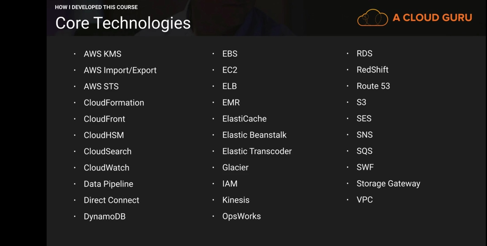
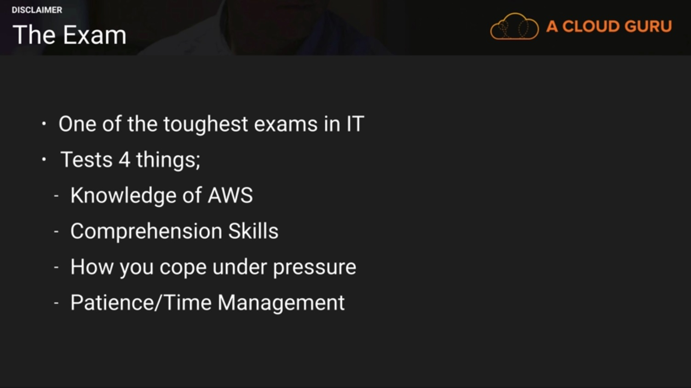
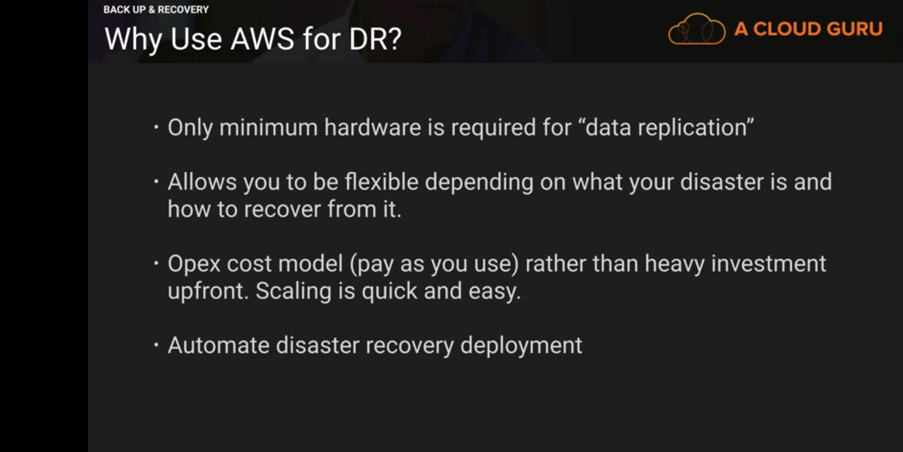
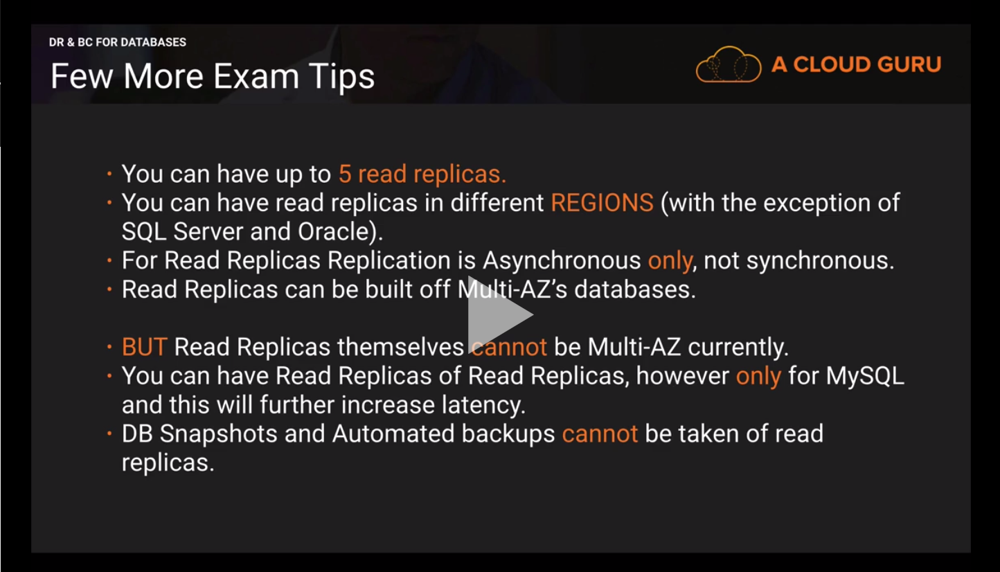

## Domain 1 (worth 10% of the exam)

### What services are important for AWS Solutions Architect Professional?

### AWS Disaster Recovery [ Backup and Recovery ]

You can study the white paper on the following link

[AWS for DR whitepaper](http://media.amazonwebservices.com/AWS_Disaster_Recovery.pdf)

### RTO (Recovery Time Objective)

The time it takes after a disruption to restore a business process to its service level, as
defined by the operational level agreement (OLA). 

RTO is the amount of time that it takes for your business to recover from an outage or disruption

It can include the time for trying to fix the problem without recovery, the recovery itself, testing and the communication to the users.

### RPO (Recovery Point Objective)
	
The acceptable amount of data loss measured in time. For example, if a disaster
occurs at 12:00 PM (noon) and the RPO is one hour, the system should recover all data that was in the system before
11:00 AM. Data loss will span only one hour, between 11:00 AM and 12:00 PM (noon).

In other words, how much data can your organization afford to lose? An hour, A day, None at all?

### What Services?

* Regions
* Storage
 - S3 : 99.999999999% durability and cross region replication
 - Glacier
 - Elastic Block Store (EBS)
 - Direct Connect
 - AWS Storage Gateway
  - Gateway-cached volumes - store primary data and cache most recently used data locally
  - Gateway Stored volumes - store entire dataset on site and asynchronously replicate data back to S3
  - Gateway-virtual tape library - Store your virtual tapes in either s3 or Glacier

* Compute 
 - EC2
 - EC2 VM Import Connector - Virtual appliance which allows you to import virtual machine images from your existing environment to Amazon EC2 instances.
* Networking
 - Route 53
 - Elastic Load Balancing
 - Amazon virtual Private Cloud
 - Amazon Direct Connect
* Databases
 - RDS
 - DynamoDB
 - Redshift

* Orchestration Services
 - Cloud Formation
 - Elastic BeanStalk
 - Opsworks

### DR Scenarios

* Backup and Restore: 
	
	Services for Backup and Restore:
	
	1. Amazon S3 is an ideal destination to backup data that might be needed quickly to perform a restore
	2. You can use aws Import/Export to transfer very large data sets by shipping storage devices directly to AWS.
	3. Amazon Glacier and Amazon S3 can be used in conjunction to provide a tiered backup solution.

	Key Steps for Backup and Restore:

	- Select an appropriate menthod or tool to backup your data into aws.
	- Ensure that you have appropriate retention policy for this data.
	- Ensure that appropriate security measures are in place for this data, including encryption and access policies.

* Pilot Light: The term pilot light is often used to describe a scenario where a minimal version of the environment is always running in the cloud. When the time comes for recovery, you can reapidly provision a full scale production environment around the critical core.
	
	Services for Pilot light:

	1. AWS RDS and EC2.
	2. From Networking point of view you can use pre allocated elastic ip addresses and associate them with your instances when invoking DR. You can also use pre allocated ENIs with pre allocated MAC addresses for applications with special licensing requirements.

	Key Steps for pilot light preparation:

	- Setup Amazon EC2 instance to replicate or Mirror data
	- Ensure that you have 	all supporting custom packages available in AWS.
	- Create and maintain AMIs of key servers where fast recovery is required.
	- Regularly run these servers, test them and apply any software updates and configuration Changes.
	- Consider automated provisioning of AWS resources.

	Key Steps for pilot light recovery:

	- Start your application Amazon EC2 instances from your custom AMIs.
	- Resize existing database/datastore instances to process the increased traffic.
	- Add additional database/datastore instances to give the DR site resilience in data tier; if you are using Amazon RDS, turn on Multi AZ to improve resilience.
	- Change dns to point at the Amazon EC2 servers.
	- Install and configure any non-AMI based systems, ideally in an automated way.

* Warm Standby: A scaled down version of fully functional environment is always running in the cloud. A warm standby solutions fully extends the pilot light elements and preparation. By identifying your business critical systems, you can fully duplicate your systems on aws and have these always on. An example could be running a miminum sized fleet of Amazon EC2 instances on the smallest size possible. In disaster the system is quickly scaled up to handle production load. Horizontal scaling is preferred over vertical scaling. 

	Key Steps for Recovery:

	- Increase the size of Amazon EC2 fleets with load balancer.(Horizontal Scaling).
	- Rest all points as pilot ligt except last point. Consider autoscaling

* Multi Site: A multi site solution runs on AWS as well as on your existing on-site infrastructure, in an active-active configuration. You can use weighted routing through Route 53, You can use EC2 Auto scaling to handle full production load. You might need some application logic to detect the failure of primary database services and cut over to the parallel database services running on AWS.

	Key Steps for Multi Site failover:

	1. Either Manually or by using DNS failover, change the DNS weighting so that all requests are sent to the AWS Site.
	2. Have application logic for failover to use the local AWS database servers for all queries.
	3. Consider using auto scaling to automatically right size the AWS fleet.  

### DR & BC for Databases

* HA for popular databases
 ** SQL Server = AlwaysOn Availability groups, SQL Mirroring
 ** MYSQl = Asynchronous Replication
 ** Oracle = Oracle Data Guard, Oralce RAC

* RDS Multi-AZ Failover
 
 ** Automatic failover in case of
 - Loss of connectivity in primary AZ
 - Loss of connectivity to the DB
 - Storage or host failure to primary DB
 - Software patching
 - Rebooting of primary DB.

* When would you use Read Replicas?

- Ready heavy workloads. Excesss read traffic can be directed to your read replica.
- Service read traffic when your source db is unavailable.
- Business reporting or data warehousing scenarios.

* Synchronous replication is used for Multi-AZ
* Asynchronous replication is used for Read Reaplicas
* If your application doesn't require transaction support, Atomicity, Consistency, Isolation, Durability compliance, joins and SQL consider dynamodb rather than RDS.

### Storage Gateways 2017

Write backup data to Storage Gateway, which then securely replicates it to S3. Data in transit is secured using SSL and encrypted at rest in Amazon S3 using AWS 256. 

* File Interface Gateway:
* Volume Interface
 - Gateway Cached Volumes
 - Gateway Stored Volumes
* Tape Interface
 - Gateway Virtual Tape Library

* File Volumes
 - NFS
* Volume Gateway
 - Cached (Gateway cached volumes)
  > iSCSI based block storage
 - Stored (Gateway stored volumes)
  > iSCSI based block storage
* Tape Gateway (Gateway-Virtual Tape library)
  > iSCSI based block storage

#### File Storage Gateway

File Gateway provides a virtual file server which enables your application to store and retrieve S3 objects using the standard file storage protocols. You don't need to modify your existing application. With File Gateway your S3 bucket is available as NFS mount point where your application can read and write files over NFS, interfacing with the gateway as a file server. Most frequently accessed data is cached on the Gateway. Data transfer between your data center and AWS is fully managed and optimized by the Gateway.

#### Gateway Cached Volumes

You can store primary data in Amazon S3 and retain your frequently accessed data locally. Cached volumes provide substantial cost savings on primary storage and retain low latency access to your frequently accessed data.

#### Gateway Stored Volumes

In the event you need low latency access to your entire data set, you can configure your on-premises data gateway to store your primary data locally and asynchronously backup point in time snapshots of this data to Amazon S3.

Gateway Stored volumes - stores data as Amazon EBS Snapshots on S3.

#### Gateway Virtual Tape Library

You can have a limitless collection of Virtual Tapes. Each virtual tape can be stored in a Vitual Tape Library backed by Amazon S3 or Virtual Tape Shelf backed by Amazon Glacier.

#### Storage sizes

* File Gateway: Unlimited amount of storage, however maximum file size is 5 TB.
* Gateway Cached Volumes: 32 Volumes supported, each having 32 TB of storage size. 1 PB of data can be stored (32 X 32)
* Gateway Stored Volumes: 32 Volumes supported, each having 16 TB of storage size. 512 TB of data can be stored (32 X 16)
* Gateway Virtual Tape Library: VTL(S3) 1500 tapes i.e. 1 PB. VTS (Glacier) unlimited tapes.

#### General FAQ's

* Can be deployed on premise, or as an EC2 instance.
* Can schedule snapshots.
* Can be used with Direct Connect.
* You can implement bandwidth throttling.
* On Premise either needs Vmware's ESXi or Hyper-V.

Hardware Requirements

* 4 or 8 VCPU's
* 7.5 GB of Ram
* 75 GB for installation of VM Image and System Data.

#### Storage Gateway Storage Requirements.

* For Cached-volumes and for VTL you need storage for local cache and an upload buffer.
* For Gateway-Stored volume configuration will need storage for your entire dataset and an upload buffer. Gateway storaed volumes can range from 1GB to 1 TB.

#### Networking Requirements

* Open port 443 on your firewalls.
* Internally you need to allow port 80 (activation only), port 3260 (by local systems to connect to iSCSI targets exposed by the Gateway) and port UDP 53 (DNS)

#### Gateway Cached and Gateway Stored Volumes

* You can take point in time, incremental snapshots of your volume and store them on Amazon S3 in the form of Amazon EBS snapshots.
* Snapshots can be initiated on scheduled or adhoc basis.

  * Gateway Stored Snapshots
    - If your volume data is stored on premises, snapshots provide durable, off-site backups in Amazon S3.
    - You can create a new Gateway-Stored volume from a snapshot in the event you need to recover a backup.
    - you can also use the snapshot of your Gateway stored volume as the starting point of your new EBS volume which you can then attach to an Amazon EC2 instance.
  * Gateway Cached Snapshots
    - Snapshots can be used to preserve versions of your data, allowing you to revert to a prior version when required.
  * Virtual Tape Library
    - Access to Virtual tapes in virtual tape library is instantaneous.
    - It takes about 24 hours for the retrieved virtual tape to be available in the selected Virtual Tape library from a Virtual Tape Shelf. 

#### Gateway-Virtual Tape Library Supports
* Symentic Netbackup version 7.x
* Symentic Backup Exec 2012
* Symentic Backup Exec 2014
* Symentic Backup Exec 15
* Microsoft System Center 2012 R2 Data protection Manager.
* Veeam Backup and Replication V7
* Veeam Backup and Replication V8
* Dell NetVault Backup 10.0 

### AWS Snowball
Amazon Import/Export disk accelerates moving large amount of data into and out of AWS cloud using protable storage devices for transport. Amazon Import/Export disk transfers your data directly onto and off of storage devices using Amazons High Speed Internal Network and bypassing the internet. As migrating a large data set to S3 over the internet might take months, hence using AWS Import/Export.

* Snowball
	It is a Petabyte-scale data transport solution which helps you transport data in and out of AWS. It's a tamper proof data enclosure of a size of a briefcase which can be used to ship a large data set to AWS to load on S3. It supports storage of upto 80 TB of Data. AWS performs an erasure of the software after the data is stored on S3, Glacier or other aws Service. It uses industry standard TPM Trusted Platform Module and 256 bit encryption designed to ensure security and full custody of your data.
* Snowball Edge
	It is a 100 TB data transfer device with onboard storage and compute capabilities. It can act as a local datacenter. Snowball Edge can cluster together to form a local storage tier and process your data on-premises, helping ensure that your applications continue to run even when they are not able to access the cloud. 
* SnowMobile
	AWS Snowmobile is an exabyte scale data transfer service used to move extremely large amounts of data to AWS. You can transfer upto 100 PB per snowmobile. Its a 45 foot long ruggedized shipping container, pulled by a semi trailer truck.
