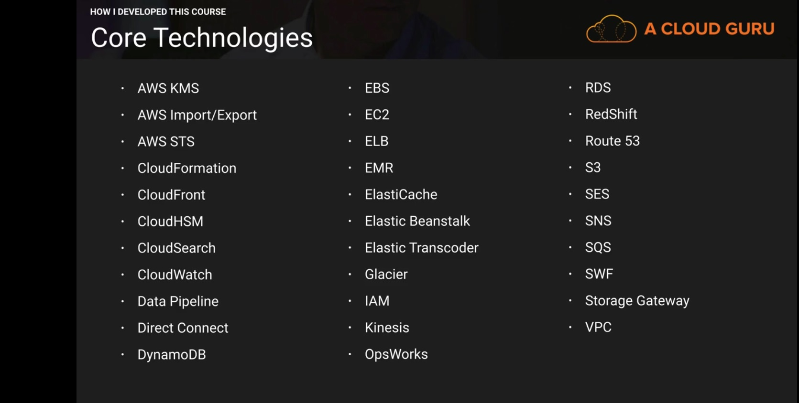

# What services are important for AWS Solutions Architect Professional?

# AWS Disaster Recovery [ Backup and Recovery ]

You can study the white paper on the following link

[AWS for DR whitepaper](http://media.amazonwebservices.com/AWS_Disaster_Recovery.pdf)

## RTO (Recovery Time Objective)

RTO is the amount of time that it takes for your business to recover from an outage or disruption

It can include the time for trying to fix the problem without recovery, the recovery itself, testing and the communication to the users.

## RPO (Recovery Point Objective)

Recovery point objective is the maximum period of time in which the data might be lost form an IT service due to a major incident.

In other words, how much data can your organization afford to lose? An hour, A day, None at all?

## What Services?

* Regions
* Storage
 - S3 : 99.999999999% durability and cross region replication
 - Glacier
 - Elastic Block Store (EBS)
 - Direct Connect
 - AWS Storage Gateway
  - Gateway-cached volumes - store primary data and cache most recently used data locally
  - Gateway Stored volumes - store entire dataset on site and asynchronously replicate data back to S3
  - Gateway-virtual tape library - Store your virtual tapes in either s3 or Glacier

* Compute 
 - EC2
 - EC2 VM Import Connector - Virtual appliance which allows you to import virtual machine images from your existing environment to Amazon EC2 instances.
* Networking
 - Route 53
 - Elastic Load Balancing
 - Amazon virtual Private Cloud
 - Amazon Direct Connect
* Databases
 - RDS
 - DynamoDB
 - Redshift

* Orchestration Services
 - Cloud Formation
 - Elastic BeanStalk
 - Opsworks

## DR Scenarios

* Backup and Restore: 
	
	Services for Backup and Restore:
	
	1. Amazon S3 is an ideal destination for backup data that might be needed quickly to perform a restore
	2. You can use aws Import/Export to transfer very large data sets by shipping storage devices directly to AWS.
	3. Amazon Glacier and Amazon S3 can be used in conjunction to product a tiered backup solution.

	Key Steps for Backup and Restore:

	- Select an appropriate menthod or tool to backup your data into aws.
	- Ensure that you have appropriate retention policy for this data.
	- Ensure that appropriate security measures are in place for this data, including encryption and access policies.

* Pilot Light: The term pilot light is often used to describe a scenario where a minimul version of the environment is always running in the cloud. When the time comes for recovery, you can reapidly provision a full scale production environment around the critical core.
	
	Services for Pilot light:

	1. AWS RDS and EC2.
	2. From Networking point of view you can use pre allocated elastic ip addresses and associate them with your instances when invoking DR. You can also use pre allocated ENIs with pre allocated MAC addresses for applications with special licensing requirements.

	Key Steps for pilot light preparation:

	- Setup Amazon EC2 instance to replicate or Mirror data
	- Ensure that you have 	all supporting custom packages available in AWS.
	- Create and maintain AMIs of key servers where fast recovery is required.
	- Regularly run these servers, test them and apply any software updates and configuration Changes.
	- Consider automated provisioning of AWS resources.

	Key Steps for pilot light recovery:

	- Start your application Amazon EC2 instances from your custom AMIs.
	- Resize existing database/datastore instances to process the increased traffic.
	- Add additional database/datastore instances to give the DR site resilience in data tier; if you are using Amazon RDS, turn on Multi AZ to improve resilience.
	- Change dns to point at the Amazon EC2 servers.
	- Install and configure any non-AMI based systems, ideally in an automated way.

* Warm Standby: A scaled down version of fully functional environment is always running in the cloud. A warm standby solutions fully extends the pilot light elements and preparation. By identifying your business critical systems, you can fully duplicate your systems on aws and have these always on. An example could be running a miminum sized fleet of Amazon EC2 instances on the smallest sized possible. In disaster the system is quickly scaled up to handle production load. Horizontal scaling is preferred over vertical scaling. 

	Key Steps for Recovery:

	- Increase the size of Amazon EC2 fleets with load balancer.(Horizontal Scaling).
	- Rest all points as pilot ligt except last point. Consider autoscaling

* Multi Site: A multi site solution runs on AWS as well as on your existing on-site infrastructure, in an active-active configuration. You can use weighted routing through Route 53, You can use EC2 Auto scaling to handle full production load. You might need some application logic to detect the failure of primary database services and cut over to the parallel database services running on AWS.

	Key Steps for Multi Site failover:

	1. Either Manually or by using DNS failover, change the DNS weighting so that all requests are sent to the AWS Site.
	2. Have application logic for failover to use the local AWS database servers for all queries.
	3. Consider using auto scaling to automatically right size the AWS fleet.  

## DR & BC for Databases

* HA for popular databases
 ** SQL Server = AlwaysOn Availability groups, SQL Mirroring
 ** MYSQl = Asynchronous Replication
 ** Oracle = Oracle Data Guard, Oralce RAC

* RDS Multi-AZ Failover
 
 ** Automatic failover in case of
 - Loss of connectivity in primary AZ
 - Loss of connectivity to the DB
 - Storage or host failure to primary DB
 - Software patching
 - Rebooting of primary DB.

* When would you use Read Replicas?

- Ready heavy workloads. Excesss read traffic can be directed to your read replica.
- Service read traffic when your source db is unavailable.
- Business reporting or data warehousing scenarios.

* Synchronous replication is used for Multi-AZ
* Asynchronous replication is used for Read Reaplicas
* If your application doesn't require transaction support, Atomicity, Consistency, Isolation, Durability compliance, joins and SQL consider dynamodb rather than RDS.

## Storage Gateways 2017

* File Interface Gateway
* Volume Interface
 - Gateway Cached Volumes
 - Gateway Stored Volumes
* Tape Interface
 - Gateway Virtual Tape Library

* File Volumes
 - NFS
* Volume Gateway
 - Cached (Gateway cached volumes)
  > iSCSI based block storage
 - Stored (Gateway stored volumes)
  > iSCSI based block storage
* Tape Gateway (Gateway-Virtual Tape library)
 - 	

