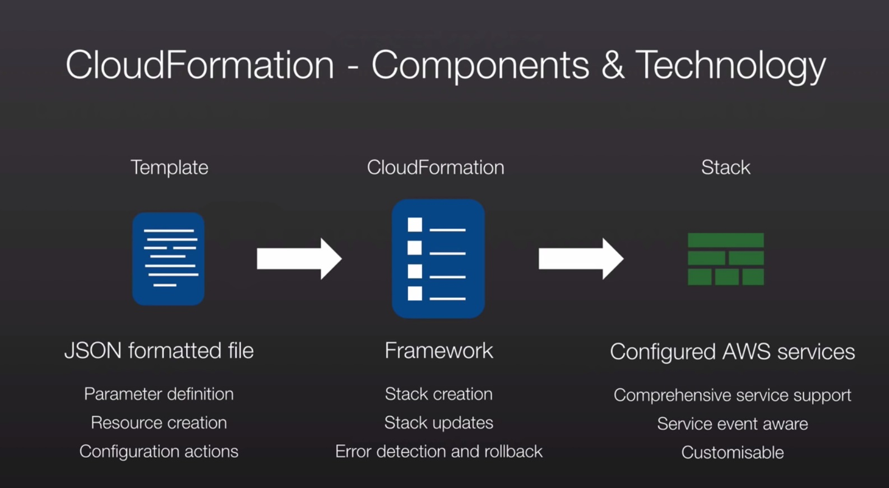

## Domain 3 (worth 10% of the exam)

### Cloudformation (Read FAQ's very important)

Cloudformation allows you to take what was once traditional hardware infrastructure and convert it into code.
Cloudformation gives developers and system administrators an easy way to create and manage a collection of related AWS resources, provisioning and updating them in an orderly and predictable fashion. You don't need to figure out the order for provisioning AWS services or the subtlities of making those dependencies work. Cloudformation takes care of this for you. CloudFormation templates can be version controlled the same way you do it for your software application.

Basically cloudformation is a way of scripting your infrastructure.

* Cloudformation stack vs Template
	A cloudformation template is essentially an architectural diagram and a cloudformation stack is the end result of that diagram (i.e what is actually provisioned).A stack is a collection of AWS resources that you can manage as a single unit.
	You don't need to figure out the order for provisioning AWS services or subtleties of making those dependencies work. Cloudformation takes care of this for you.
* Elements of a template
	- Mandatory Elements:
	List of AWS Resources and their associated configuration values.
	- Optional Elements
		- The template file format and version number.
		- Input values that are supplied at the stack creation time.
		- Output values required once a stack has finished building.
		- List of data tables: Used to lookup static configuration values such as AMI's etc.
* Cloudformation templates can be in YAML or JSON format.
* You can use Fn:GetAtt to output data.
```
"PublicIP":{
	"Description":"Public IP address of the web server",
	"Value":{
		"Fn::GetAtt":[
			"WebServereHost",
			"PublicIp"
		]
	}
}
```
* Chef and Puppet integration
	Cloudformation supports chef and puppet integration as well as Bootstrap scripts.
* Stack Creation Errors
	By default the "automatic rollback on error" feature is enabled. This will cause all AWS resources that AWS cloudformation created successfully for a stackup to the point where an error occured to be deleted. 
* Stacks can wait for Applications
	AWS Cloudformation provides a WaitCondition resource that acts as a barrier, blocking the creation of other resources until a completion signal is received from an external source, such as your application or management system.
* You can Specify deletion policies.
	You can specify that a resource should be preserved and not deleted when the stack is deleted. Eg Amazon S3 buckets.
	You can specify that the snapshots be created for Amazon EBS volumes or Amazon RDS instances before they are deleted.
* Cloudformation can be used to create Roles in IAM and assign it to EC2 instances.
* Cloudformation can be used to create VPC's, subnets, internet gateways, route tables, ELB's etc.
* You can specify IP address ranges both in terms of CIDR ranges as well as Individual IP addresses for specific instances.
* VPC Peering: You can enable VPC peering using Cloudformation, but only within the same AWS account.
* CloudFormation supports Route 53, creation of hosted zones, adding, updating and deleting records.

#### Change Sets

When you need to update a stack, understanding how your changes will affect running resources before you implement them can help you update stacks with confidence. Change sets allow you to preview how proposed changes to a stack might impact your running resources, for example, whether your changes will delete or replace any critical resources, AWS CloudFormation makes the changes to your stack only when you decide to execute the change set, allowing you to decide whether to proceed with your proposed changes or explore other changes by creating another change set. You can create and manage change sets using the AWS CloudFormation console, AWS CLI, or AWS CloudFormation API.

#### Stack Sets

AWS CloudFormation StackSets extends the functionality of stacks by enabling you to create, update, or delete stacks across multiple accounts and regions with a single operation.

#### Cloudformation template Anatomy

http://docs.aws.amazon.com/AWSCloudFormation/latest/UserGuide/template-anatomy.html

#### Reference Function

Reference function is used to avoid Name Space collissions. It allows you to backreference resources that are created within the same template.

#### Literal References

There might be times where you need to reference resources that are created outside of cloudformation. You can use literal references for that.


Here MyExistingSG and mykey are the existing security group and key name which are referenced.
```
{
	"Resources" : {
		"Ec2Instance" : {
			"Type" : "AWS::EC2::Instance",
			"Properties" : {
				"SecurityGroups" : [ { "Ref" : "InstanceSecurityGroup" }, "MyExistingSG" ],
				"KeyName" : "mykey",
				"ImageId" : "ami-7a11e13" 
			}
		}
	}
}
```

#### Referencing input parameters 
The input parameters can be specified at the stack creation time using both the cli or console.

Here KeyPair is referenced in the below example
```
{
	"Parameters" : {
		"KeyPair":{
			"Description" : "The EC2 key pair to allow ssh access to the instance",
			"Type" : "String"
		}
	},
	"Resources" : {
		"Ec2Instance" : {
			"Type" : "AWS::EC2::Instance",
			"Properties" : {
				"SecurityGroups" : [ { "Ref" : "InstanceSecurityGroup" } ],
				"KeyName" : { "Ref" : "KeyPair" },
				"ImageId" : "" 
			}
		}
	}
}
```

#### Conditional Values

If you want to make a template portable across various regions you may want to use different AMI ids in the template. And hence you might need a region to ami mapping for provisioning resources in different regions. You can use Mapping as a mechanism for handling this. In the example below the Ec2Instance Resource uses the FindInMap function to refer to RegionMap and find the appropriate ami value as per the region input.

```
{
	"Mappings" : {
		"RegionMap" : {
			"us-east-1" : { "AMI" : "ami-76f0004h" },
			"us-west-1" : { "AMI" : "ami-75f0604h" },
			"eu-west-1" : { "AMI" : "ami-7fd4004h" },
			"ap-southeast-1" : { "AMI" : "ami-7fd9844h" },
			"ap-northeast-1" : { "AMI" : "ami-7fd29404h" },
		}
	},
	"Resources" : {
		"Ec2Instance" : {
			"Type" : "AWS::EC2::Instance",
			"Properties" : {
				"SecurityGroups" : [ { "Ref" : "InstanceSecurityGroup" } ],
				"KeyName" : { "Ref" : "KeyPair" },
				"ImageId" : {
					"Fn::FindInMap" : [ "RegionMap", { "Ref" : "AWS::Region" }, "AMI"]
				} 
			}
		}
	}
}
```

#### File and Services Key in Cloudformation templates

File key allows you to write files to the instance filesystem
Services key allows you ensure that the services are not only running when cfn-init finishes; but they are also restarted upon reboot.

#### CloudFormation Best Practises:

* Use Cross-Stack References to Export Shared Resources
* Use IAM to Control Access
* Reuse Templates to Replicate Stacks in Multiple Environments:
	To make templates reusable, use the parameters, mappings, and conditions sections so that you can customize your stacks when you create them. For example, for your development environments, you can specify a lower-cost instance type compared to your production environment, but all other configurations and settings remain the same.
* Use Nested Stacks to Reuse Common Template Patterns:
	For example, assume that you have a load balancer configuration that you use for most of your stacks. Instead of copying and pasting the same configurations into your templates, you can create a dedicated template for the load balancer. Then, you just use the AWS::CloudFormation::Stack resource to reference that template from within other templates.
* Create Change Sets Before Updating Your Stacks
* Use Stack Policies:
		Stack policies help protect critical stack resources from unintentional updates that could cause resources to be interrupted or even replaced. A stack policy is a JSON document that describes what update actions can be performed on designated resources. Specify a stack policy whenever you create a stack that has critical resources.

		During a stack update, you must explicitly specify the protected resources that you want to update; otherwise, no changes are made to protected resources. 
* Use AWS::CloudFormation::Init to Deploy Software Applications on Amazon EC2 Instances
* CloudFormation Helper Scripts Reference
	Currently, AWS CloudFormation provides the following helpers:
	- cfn-init: Used to retrieve and interpret the resource metadata, installing packages, creating files and starting services.
	- cfn-signal: A simple wrapper to signal an AWS CloudFormation CreationPolicy or WaitCondition, enabling you to synchronize other resources in the stack with the application being ready.
	- cfn-get-metadata: A wrapper script making it easy to retrieve either all metadata defined for a resource or path to a specific key or subtree of the resource metadata.
	- cfn-hup: A daemon to check for updates to metadata and execute custom hooks when the changes are detected.


#### Exam tips
* Cloudformation - big topic in the exam
* Know all the services that are supported.
* Remember what is mandatory for a template - "Resources"
* You can create multiple VPC's inside one template
* You can enable VPC peering using cloudformation but only within the same AWS account.
* Chef,Puppet and bootstrap scripts are supported.
* You can use Fn:GetAtt to output data

#### AWS Cloudformation masterclass webinar notes



##### Troposphere (https://github.com/cloudtools/troposphere)

troposphere - library to create AWS CloudFormation descriptions
The troposphere library allows for easier creation of the AWS CloudFormation JSON by writing Python code to describe the AWS resources. troposphere also includes some basic support for OpenStack resources via Heat.
To facilitate catching CloudFormation or JSON errors early the library has property and type checking built into the classes.

#### Watch and read these resources for cloudformation:

https://aws.amazon.com/cloudformation/aws-cloudformation-articles-and-tutorials/
https://www.brighttalk.com/webcast/9019/105175?channel=CP


### Elastic Beanstalk

Elastic beanstalk automatically handles deployment details of capacity provisioning, load balancing, auto-scaling, and application health monitoring once the code is uploaded to Beanstalk. Elastic Beanstalk is a provisioning engine.
AWS Beanstalk is desinged to support multiple running environments. Elastic Benastalk also tracks and stores application versions over time, so an existing environment can be easily rolled back to a prior version or a new environment can be launched using an older version.

#### Elastic Beanstalk supports the following languages:
	* Package Builder
	* Apache with PHP
	* Apache with Python
	* Apache Tomcat for Java Applications
	* NGinx or Apache for Nodejs applications
	* Docker
	* Ruby
	* Go
	* Java SE
	* .NET
	* PHP
	* Python

- Elastic Beanstalk can automatically provision an RDS instance. The connectivity information to the DB instance is exposed to your application by environment variables.
- Beanstalk can be configured to be fault tolarent within a single region with multiple AZ's
- Elastic Beanstalk Security
	- By default you application is available publicly at myapp.elasticbeanstalk.com
	- It integrates with VPC.
	- Fully Supports IAM
	- Code is stored in S3
	- Only the changes from git repository are replicated.
	- Amazon Linux AMI and Windows 2008 R2 are supported with Beanstalk.

#### AWS Opsworks

AWS Opsworks is an application management service that helps automate operational tasks like code deployment, software configurations, package installations, database setups and server scaling using chef.
OpsWorks includes automation to scale your application based on time and load.

Chef turns infrastructure into code. With Chef, you can automate how you build, deploy and manage your infrastructure. Your infrastructure becomes as versionable, testable and repeatable as application code.

Chef Server stores your recipes as well as other configuration data. The chef client is installed on each virtual server, container or networking device you manage - we'll call these nodes. The client periodically polls the chef server. If anything on the node is out of date, the client brings it up to date.

#### AWS OpsWorks Lab

In Opsworks we have stacks and layers. Here a stack can be your production stack, test and dev stack etc. Basically a stack is a collection of Layers.

Layer can be a blue print for a set of EC2 instances, an elb or an RDS database. Layers sit within stacks.

After you attach an elastic load balancer to a layer, OpsWorks removes any currently registered instances and then manages the load balancer for you. If you subsequently use the ELB console or API to modify the configuration, the changes will not be permanent.

There are 3 stacks provided by OpsWorks. 
* Sample Stack: Sample stack with Nodejs app configured
* Chef 12 Stack: You can use your own chef cook books or community cook books. 
* Chef 11 Stack: You can use AWS built in cook books for applications and deployments.		 

##### Time based and Load based instances

OpsWorks automatically starts and stops time based instances based on a specified schedule.
OpsWorks automatically starts and stops load based instances in response to CPU, memory and application load changes across all instances in a layer.


##### Apps

An app represents a code stored in a repository and that you want to install on the application server instances. When you deploy the app OpsWorks downloads the code from the repository to the specified server instance. You can deploy the code without having to ssh inside the instance.


