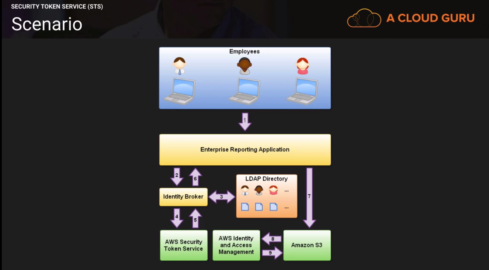
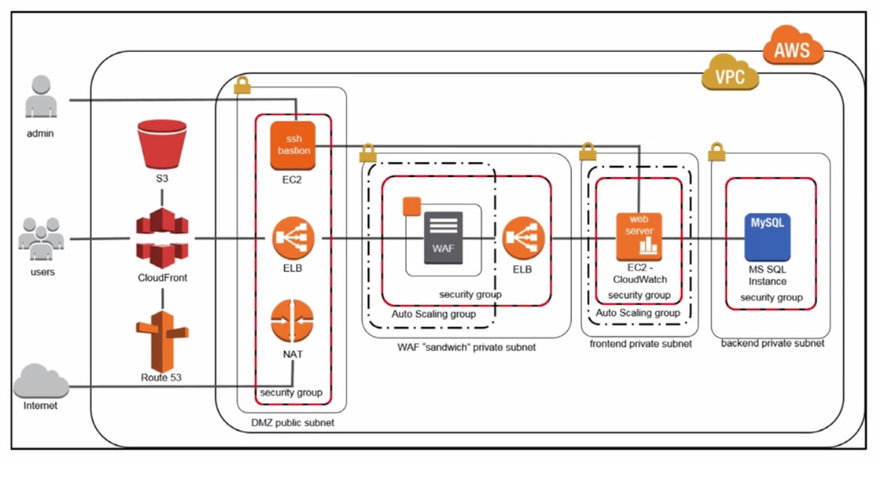
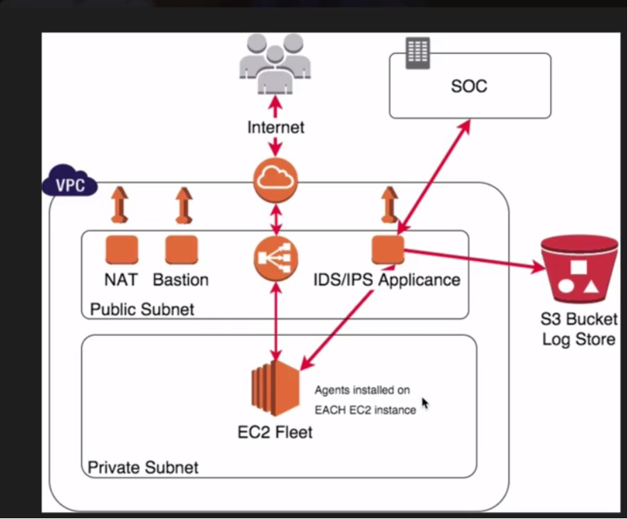

## Domain 6 (worth 20% of the exam)

### AWS Directory Services

AWS Directory services is a managed service that allows you to connect your AWS resources with an existing on premises Microsoft Active Directory or setup a new stand-alone directory in aws cloud.

* Comes in two flavors:
  * AD connector
  * Simple AD  

* AD Connector (Used for existing AD deployments)
 
  AD connector enables you to easily connect your existing on premises Microsoft Active Directory to the AWS cloud without requiring complex directory synchronization technologies or the cost and complexity of hosting a federation infrastructure.

	Once Setup, your end users and IT administrators can use their existing corporate credentials to log on to AWS applications such as Amazon Workspaces, Amazon Docs, Amazon Workmail and to manage AWS resources via AWS Identity and Access Management role based access to the AWS Management console.

  * Your existing security policies such as password expiration, password history and account lock outs can be enforced consistently.
  * You can enable multi factor authentication

* Simple AD
  * It is a managed directory powered by Samba 4 Active Directory Compatible Server.
  * Supports user accounts, group memberships, domain joining Amazon EC2 instances running Linux and Microsoft Windows
  * Kerberos based single sign-on.
  * Used for New AD Deployments
  * MFA not supported
  * Cannot add additional AD Servers
  * No Trust Relationships
  * Cannot Transfer FSMO Roles.

### AWS Security Token Service (STS)	

* STS grants users limited and temporary access to AWS resources. Users can come from three sources;
  * Federation (typically active directory)
    * Uses Security Assertion Markup Language (SAML)
   			If your organization uses an identity provider (IdP) that is compatible with SAML, such as Microsoft's Active Directory Federation Services or open-source Shibboleth, you can set up access to the AWS Management Console without writing code.
    * Grants Temporary access based off users Active Directory Credentials. Does not need to be a user in IAM.
    * Single Sign on allows users to login to AWS console without Assigning IAM credentials.

  * Federation with Mobile Apps
    - Use facebook/Amazon/Google or other OpenID providers to login
  
  * Cross Account Access
    - Let's users from one AWS account access resources into another.

* Understanding the key Terms
  * Federation
    - Combining or joining a list of users in one domain with the list of users in another domain (such as Active Directory, Facebook etc)
  * Identity Broker
    - A service that allows you to take an identity from point A and join it (federate it) to point B.
  * Identity Store
    - Services like Active Directory, Facebook, Google etc.
  * Identities
    - A user of a service like facebook etc.

* Following Actions are Supported through STS:
  * AssumeRole: Typically, you use AssumeRole for cross-account access or federation. You cannot call AssumeRole by using AWS root account credentials; access is denied. You must use credentials for an IAM user or an IAM role to call AssumeRole. 
  * AssumeRoleWithSAML: This operation provides a mechanism for tying an enterprise identity store or directory to role-based AWS access without user-specific credentials or configuration.
  * AssumeRoleWithWebIdentity: Returns a set of temporary security credentials for users who have been authenticated in a mobile or web application with a web identity provider, such as Amazon Cognito, Login with Amazon, Facebook, Google, or any OpenID Connect-compatible identity provider. Calling AssumeRoleWithWebIdentity does not require the use of AWS security credentials.
  * DecodeAuthorizationMessage: Decodes additional information about the authorization status of a request from an encoded message returned in response to an AWS request.
  * GetCallerIdentity: Returns details about the IAM identity whose credentials are used to call the API.
  * GetFederationToken: A typical use is in a proxy application that gets temporary security credentials on behalf of distributed applications inside a corporate network. Because you must call the GetFederationToken action using the long-term security credentials of an IAM user, this call is appropriate in contexts where those credentials can be safely stored, usually in a server-based application.
  * GetSessionToken: Typically, you use GetSessionToken if you want to use MFA to protect programmatic calls to specific AWS APIs like Amazon EC2 StopInstances. 

| AWS STS API|Who can call|Credential lifetime (min/max/default)|MFA support*|Passed policy support*|Restrictions on resulting temporary credentials|
|--- |--- |--- |--- |--- |--- |
|AssumeRole|IAM user or user with existing temporary security credentials|15m/1hr/1hr|Yes|Yes|Cannot call GetFederationToken or GetSessionToken.|
|AssumeRoleWithSAML|Any user; caller must pass a SAML authentication response that indicates authentication from a known identity provider|15m/1hr/1hr|No|Yes|Cannot call GetFederationToken or GetSessionToken.|
|AssumeRoleWithWebIdentity|Any user; caller must pass a web identity token that indicates authentication from a known identity provider|15m/1hr/1hr|No|Yes|Cannot call GetFederationToken or GetSessionToken.|
|GetFederationToken|IAM user or AWS account root user|IAM user: 15m/36hr/12hr Root user: 15m/1hr/1hr|No|Yes|Cannot call IAM APIs directly. SSO to console is allowed.* Cannot call AWS STS APIs except GetCallerIdentity.|
|GetSessionToken|IAM user or root user|IAM user:15m/36hr/12hr Root user: 15m/1hr/1hr|Yes|No|Cannot call IAM APIs unless MFA information is included with the request. Cannot call AWS STS APIs except AssumeRole or GetCallerIdentity. Single sign-on (SSO) to console is not allowed, but any user with a password (root or IAM user) can sign into the console.*|

Single sign-on (SSO) to the console. To support SSO, AWS lets you call a federation endpoint (https://signin.aws.amazon.com/federation) and pass temporary security credentials. The endpoint returns a token that you can use to construct a URL that signs a user directly into the console without requiring a password.

#### Scenario

- Employee enters an username and password.
- Application contacts an identity broker. The broker captures the username and password.
- Identity broker uses the organizations LDAP directory (IdP - Identity provider) to validate the employees identity.
- Identity broker then calls Assume Role or GetFederationToken function using the long-term AWS security credentials of an IAM user to obtain temporary security credentials for the application user. The call must include an IAM policy which is attached to the temporary security credentials and duration (1 to 36 hours). The passed policy is used to scope down the permissions that are available to the IAM user, by allowing only a subset of the permissions that are granted to the IAM user.
- The Security token service confirms that the policy of the IAM user making call to the GetFederationToken function gives permission to create new tokens and then returns 4 values to the application: An access key, a secret access key, a token and a duration.
- The Identity broker retruns the temporary credentials to the reporting application.
- The application uses the credentials to make calls to S3
- Amazon S3 uses IAM to verify that the credentails allow the requested operation on the given S3 bucket and key.
- IAM provides S3 with the go-ahead to perform the requested operation.

Note:

If you are creating a mobile-based or browser-based app that can authenticate users using a web identity provider like Login with Amazon, Facebook, Google, or an OpenID Connect-compatible identity provider, we recommend that you use Amazon Cognito or AssumeRoleWithWebIdentity. For more information, see Federation Through a Web-based Identity Provider.

#### In the Exam

* Develop an Identity broker to communicate with AWS STS and LDAP.
* Identity Broker first communicates with LDAP then STS
* Application then gets temporary access to AWS resources.

### Monitoring

* Cloud Trail is used for auditing and collecting a history of API calls made on your environment. It is not a logging service per se.
* CloudWatch is a monitoring service for AWS cloud resources. It can be used to collect and track metrics, monitor log files and set Alarms.
* CloudWatch logs will store your log data indefinitely.
* CloudWatch Alarm history is only stored for 14 days however. 
* Each CloudWatch Alarm costs $0.10 per month.
* CloudWatch can be used to monitor Cloud Trail logs in real time. CloudTrail sends log files from all those regions to a CloudWatch Logs log group.
* CloudWatch now supports Cross Accout Subscriptions. You can use cloudwatch to monitor multiple AWS accounts.
* You can send your logs to
  - CloudWatch 
  - S3
  - Third Parties (AlertLogic, SumoLogic, Splunk etc.)
* CloudTrail can log events from multiple account to a single S3 bucket.

### Cloud HSM (Hardware Security Modules)

HSM is a plysical device that safegaurds and manages digital keys for strong authentication and provides crypto processing. These modules traditionally come in the form of plugin in card.
You can securely generate,store and manage the cryptographic keys used for data encryption such that they are accessible only by you.

#### Exam Tips

* Cloud HSM is single Tenanated (1 physical device for you only.)
* Must be used within a VPC
* You can use VPC peering to connect to CloudHSM
* You can use EBS volume encryption, S3 Object Encryption, and key management with CloudHSM, but this does require custom application scripting.
* If you need fault tolerance, you need to build a cluster, so you will need 2. If you have one only and it fails, you will lose your keys.
* Can integrate with RDS (Oracle & SQL) as well as Redshift
* Monitor via Syslog.

### DDOS Mitigation in the cloud.

DDOS is an attack that attemts to make your application unavailable to the end users.
This can be achieved by multiple mechanisms such as large packet floods by using a combination of reflection and amplification techniques or use of large botnets.

#### Amplification/Reflection attacks

Amplification/Reflection attacks can include things such as NTP,SSDP,DNS,charge,SNMP attacks etc. It is where an attacker might send a third party server such as an NTP server a packet through a spoofed IP address. The server will then respond with a payload which is 28-54 times larget than the actual request to the spoofed ip address.
Attackers can co-ordinate this and use multiple NTP servers a second to send legitimate NTP traffic to the target.

#### Application attacks (L7)

Here an attacker might send a flood of get requests using botnets to completely drain out the targets webserver, so that the application becomes unavailable to the legitimate end user. Or attacker might send get requests that are so slow that the webserer might take a while to respond. This is called the slow lorris attack. Here due to the slow request and respone a large number of connections are held up with the webserer and it would stop responding when the connection reach capacity.

#### How to mitigate DDOS?

* Minimize Attack surface area
* Be ready to scale to absorb the attack.
* Safegaurd Exposed Resources.
* Learn normal behaviour.
* Create a plan for attacks.

  - Minimize the attack surface area
  Secure all your web application and database servers to private subnets and use bastion or jump boxes that only allow access to a specific whitelisted ip addresses to those bastion servers.

  

  - A waf (Web Application Firewall) is a virtual machine that sits in a private subnet behind the autoscaling group and inspects all the traffic on layer 7.
  - Safegaurd Exposed resources
  There are three resources that provide this control and flexibility
    - Amazon cloudfront: provides GEO Restriction/Blocking and Origin Access Identity (Restrict access to your S3 bucket so that people can only access S3 using cloudfrint urls.) 
    - Amazon Route 53:
      - Alias Record Sets: You can use these to immediately redirect your traffic to an amazon cloudfront distribution or to a different ELB loadbalacer with higher capacity EC2 instances running WAFs or your own security tools. There's no propagation delay when the Alias records are changed.
      -  Private DNS: It allows you to internally manage internal DNS names for your application Resources without exposing this information to the public internet.       
    - Web application Firewalls (WAFs): Application level attacks can be mitigated by using WAFs available with AWS as a service or WAFs available on AWS Market Place.
  - Learn Normal Behaviour:
    - Know the different types of traffic and what normal levels of this traffic should be. You can create alarms to alert you of abnormal behaviour.    

### IDS and IPS

* IDS is intrusion detection
* IPS is intrusion prevention
* Generally you have an appliance in a public subnet and then agents installed on each EC2 instance. Appliance can be from service providers like trendmicro, alertlogic etc. IDS and IPS appliance can send traffic logs to SOC or S3 where it is analyzed. The agents installed on EC2 instances communicates log data to IPS/IDS device which performs intelligence on that data and sends it to SOC or S3.
* Logs can be sent to SOC (Security Operation Center) or stored in S3 
### Exam Tips

* Domain 6: Security
  * Design information security management systems and complaince controls.
  * Design security controls with the AWS shared responsibility model and global infrastructure.
  * Design identity and access management controls.
  * Design protection of data at rest controls
  * Design protection of Data in Flight and Network Perimeter controls. 
* Remember the technologies you can use to mitigate a DDOS attack.
* Read whitepaper : https://d0.awsstatic.com/whitepapers/DDoS_White_Paper_June2015.pdf
* Read Cloud HSM
* Read Directory Services: AD Connector and Simple AD
* IDS and IPS
* Read Monitoring
* Identity Broker
