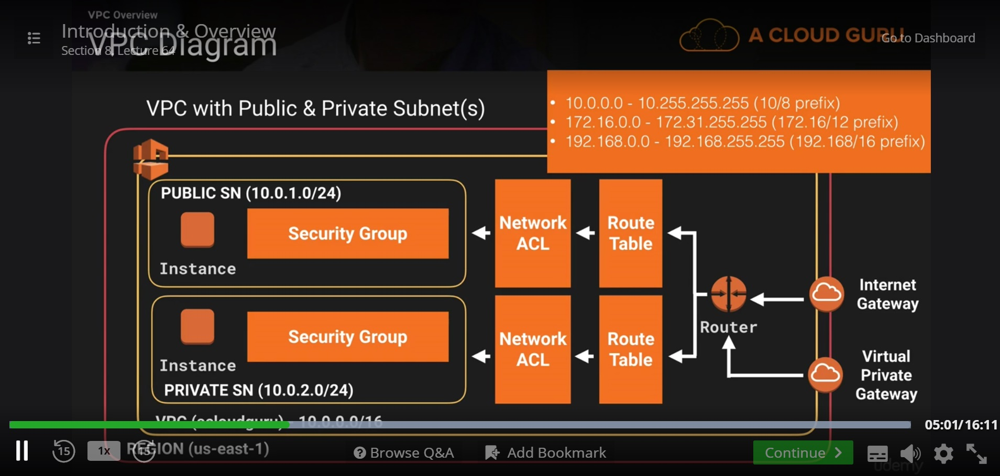
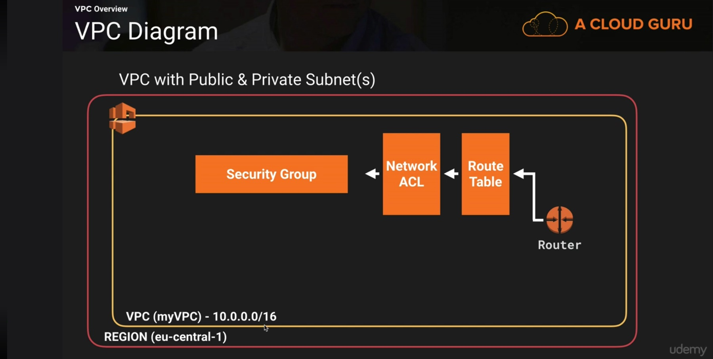
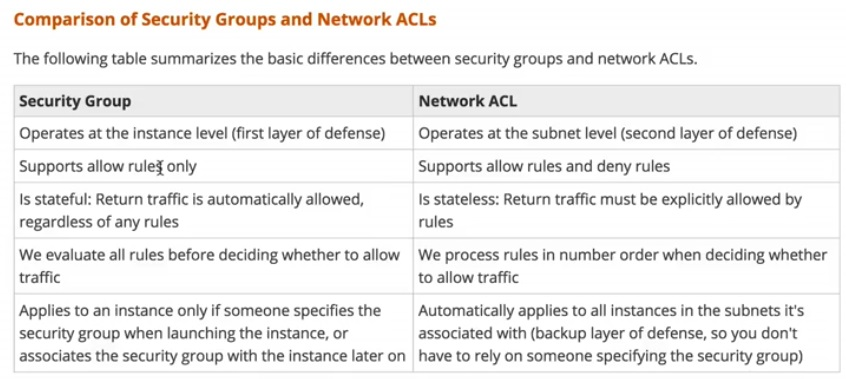

# VPC

## Section 8, Lecture 64 (Introduction and Overview)

Amazon Virtual Private cloud lets your proivison logically isolated section of the Amazon Web Services cloud 
where you can launch AWS services in a virtual network that you define. You have complete control over your virtual networking environment,
including selection of your own ip address range, creation of subnets and configuration of route tables and network gateways.

* RFC 1918 defines 3 private ip address network ranges for use throughout the world
 * 10.0.0.0 - 10.255.255.255 (10/8 prefix)
 * 172.16.0.0  - 172.31.255.255 (172.16/12 prefix)
 * 192.168.0.0 - 192.168.255.255 (192.168/24 prefix)
 Out of which 10.0.0.0 is the largest octet and privdes you with most nummber of ip addresses. But when using VPC AWS allows you to use the 
 largest network size of 10.0.0.0/16 CIDR block

* Network ACLs and security groups can span over subnets.
* 1 subnet can span only one availability zone.
* Subnets can be either public or private. You can assign custom IP address ranges in each subnet.
* You can configure route tables betwee subnets. And those route tables will define whether or not a subnet is 
going to be public or private.
* Yo can create an internet Gateway and attach it to your VPC. We can have only one internet Gateway per VPC.
* Instance security groups are stateful. When you allow http into your security group be default http is allowed out of your security group.
* Subnet Access control Lists are stateless. If you make a rule to allow http into your subnet you also have to create a rule to allow 
http out of your subnet.

### Default VPC vs Custom VPC.

* Default VPC
 * Default VPC is user friendly, allowing you to immediately deploy instances
 * All subnets in default VPC have a route out to the internet
 * Each instance has both public and private IP address
 * If you delete the default VPC the only way to get it back is to contact AWS.

### VPC peering

* Allows you to connect one VPC with another via a direct network route using Private IP addresses.
* Instances behave as if they are on the same private network
* You can peer VPCs with other AWS accounts as well as with other VPC's in the same account
* Peering is always done in a star configuration, ie 1 central VPC peers with 4 others. You cannot do transitive peering.

## Section 8, Lecture 65 (Build your own custom VPC)

* When we craate a VPC it aws doesn't automatically create a subnet, intetnet gateways but automatically creates route table, network acls 
and security groups.
* While creating any subnet you would get 5 address less than the subnet size. So for a 0 - 255 subnet you would get 251 addresses.
Due to the following for a 10.0.0.0/24 subnet. 
 * 10.0.0.0 - Network Address
 * 10.0.0.1 - Reserved by AWS for VPC Router
 * 10.0.0.2 - Reserved by AWS. The IP address of the DNS server is always the base of VPC network range plus 2. AWS also reserves base of each subnet range plus 2.
 * 10.0.0.3 - Reserved by AWS for Future use.
 * 10.255.255.255 - Broadcast address
 
 Lab on creating an instance in a Public Subnet. IGW creation, route table creation, attaching IGW to VPC etc.
 
 
 
## Section 8, Lecture 66 (Build your own custom VPC Part 2)

Privisioning an instance into private subnet and accessing it through an instance in public subnet.

## Section 8, Lecture 67 (Network Address Translation)

NAT instance vs NAT Gateway (http://docs.aws.amazon.com/AmazonVPC/latest/UserGuide/vpc-nat-comparison.html)

* NAT Instance
  * Source destination check on a nat instance should be disabled, because it is not going to act as destination or originator of any traffic, we are going to route traffic from our private subnet resources to the internet and vice versa throught the nat instance.
  * NAT instance can be launched using AWS NAT linux amis available in the market place.
  * NAT instance should be launched in public subnet. It should have a public IP address as well.
  * Add the NAT instance to the route of private subnet.
  * The amount of traffic that a nat instance supports depends on the instance size. so if you are bottlenecking, increase the instance size.
  * You can create high availability of NAT instances using Auto Scaling groups, multiple subnets in different AZ's and a script to automate failover.
  * NAT instances are always behind a security group.
* NAT gateways
  * Scale automatically upto 10 GBPS
  * No need to patch them
  * No need to assign them with security groups.
  * Once NAT gateway is created, associate them with private subnet.

## Section 8, Lecture 67 (Network Access Control Lists Vs Security groups)

* Network ACL's
  * With your VPC comes a default Network ACL and by default it allows all outbound and in bound traffic.
  * You can create a Custom Network ACL. By default a custom network ACL denies all inbound and outbound traffic until you add rules
  * Each subnet in your vpc must be associated with a network ACL. If you donot explicitly associate a subnet with a network ACL, the subnet is automatically associated with the default network ACL.
  * You can associate a network ACL with Multiple Subnets, however a subnet can be associated only with one Network ACL at a time. When you associate a network ACL with a subnet, the previous association is removed.
  * A network ACL contains a numbered list of rules that is evaluated in order, starting with the lowest numbered rule.
  * A network ACL has separate inbound and outbound rules, and each rule can either allow or deny traffic.
  * Network ACLs are stateless; responses to the allowed inbound traffic are subject to rules for ourbound traffic (and vice versa).

What will you do if you want to block traffic on a particular port for an ip address range. What will you use network acl or security groups?
- Network ACL.

* Ephemeral ports:

The example network ACL in the preceding section uses an ephemeral port range of 49152-65535. However, you might want to use a different range for your network ACLs depending on the type of client that you're using or with which you're communicating.

The client that initiates the request chooses the ephemeral port range. The range varies depending on the client's operating system. Many Linux kernels (including the Amazon Linux kernel) use ports 32768-61000. Requests originating from Elastic Load Balancing use ports 1024-65535. Windows operating systems through Windows Server 2003 use ports 1025-5000. Windows Server 2008 and later versions use ports 49152-65535. A NAT gateway uses ports 1024-65535. For example, if a request comes into a web server in your VPC from a Windows XP client on the Internet, your network ACL must have an outbound rule to enable traffic destined for ports 1025-5000.

If an instance in your VPC is the client initiating a request, your network ACL must have an inbound rule to enable traffic destined for the ephemeral ports specific to the type of instance (Amazon Linux, Windows Server 2008, and so on).

In practice, to cover the different types of clients that might initiate traffic to public-facing instances in your VPC, you can open ephemeral ports 1024-65535. However, you can also add rules to the ACL to deny traffic on any malicious ports within that range. Ensure that you place the DENY rules earlier in the table than the ALLOW rules that open the wide range of ephemeral ports.

## Section 8, Lecture 69 (ELB's & VPC's)

ELB's

Interner facing ELBS should be created in Public Subnets.

## Section 8, Lecture 70 (Nats Vs Bastions)

* A Nat if used to provide internet traffic to EC2 instances in private subnets.
* A Bastion is used to Securely administer EC2 instances (using ssh or RDP) in private subnets. In australia we call them jump boxes.

## Section 8, Lecture 71 (VPC Flow Logs)

* Flowlogs help you to capture IP traffic flow information for the network interfaces resources. So basically it is going to capture all the traffic and report it to cloudwatch.
* An cloudwatch access IAM role is needed to log traffic to cloudwatch. Also you need to create a log group, and option in cloudwatch.
* Any traffic that's going into the VPC will be logged against the eni names.
* You also have to create log stream in log group inorder to see all the log data.

## Section 8, Lecture 72 (VPC Cleanup)
Most of the things are known

## Section 8, Lecture 73 (VPC Summary)

[VPC FAQ's](faqs/aws-vpc-faqs.md)
