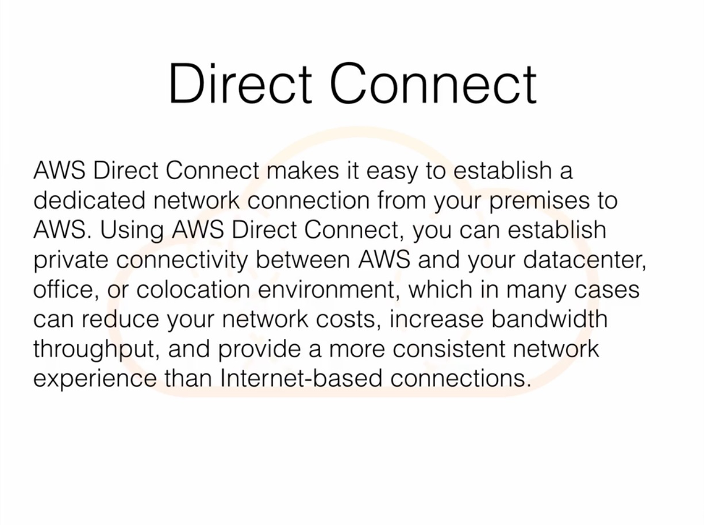
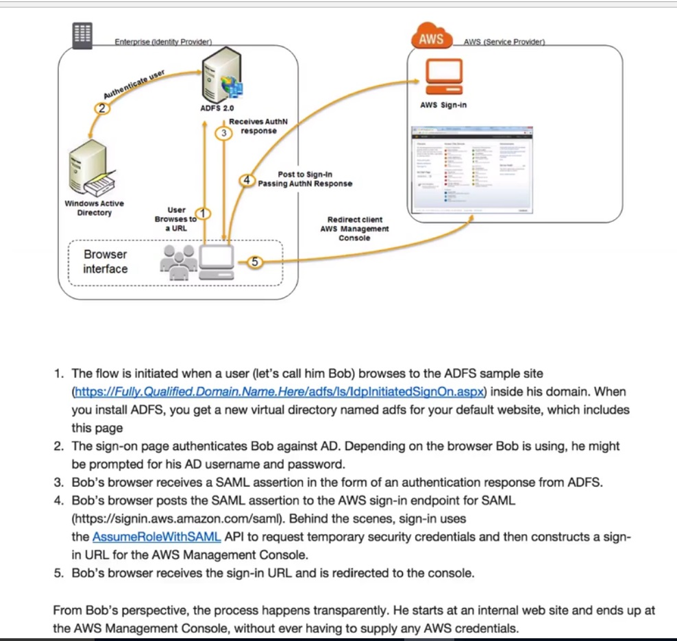
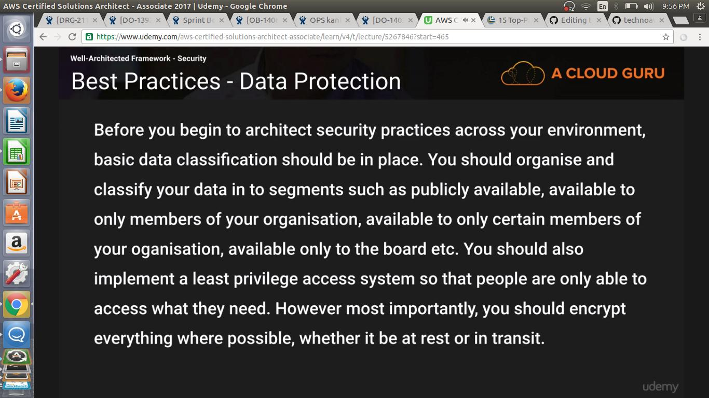

# Exam Tips

## Section 12, Lecture 92 (Exam Tips based on Student Feedback)


## Section 12, Lecture 93 (Consolidated Billing)


## Section 12, Lecture 94 (Resource Groups and tagging)

What are Resource Groups?
Resource groups make it easy to group your resources using the tags that are assigned to them. You can group resources that share one or more tags.

Resource groups contain information such as:
 * Region
 * Name
 * Health Checks

Specific Information
 * For EC2 public and private addresses
 * For ELB port configurations
 * For RDS - Database Engine etc.

Resource group can bring together tagged resources across all the regions.

## Section 12, Lecture 95 (VPC peering)

## Section 12, Lecture 96 (Direct Connect)

* Direct Connect Benefits
 * Reduce costs when using large volumes of traffic
 * Increase reliability
 * Increase traffic
 
How is Direct Connect different from a VPN?
VPN connections can be configured in munites and can be a good solution if you have an immediate need, have low to modest bandwidth requirements, and can tolerate the inherant variability in Internet-based connectivity. Direct connect doesnot involve the internet instead it uses dedicated, private network connections between your intranet and Amazon VPC.




## Section 12, Lecture 97 (Active Directory Integration)



Read

* https://aws.amazon.com/premiumsupport/knowledge-center/snapshot-ebs-raid-array/
* The valid ways of encryption data on S3 are Server Side Encryption (SSE)-S3, SSE-C, SSE-KMS or a client library such as Amazon S3 Encryption Client.
* Incorrect. http://docs.aws.amazon.com/AmazonS3/latest/dev/acl-overview.html
* Byheart region names eg. Ireland is EU West
* All FAQ's

# Introduction to well Architected Framework

Well Architected Framework Link. This will feature very heavily in the Exam.
```
https://d0.awsstatic.com/whitepapers/architecture/AWS_Well-Architected_Framework.pdf
```

## Section 13, Lecture 99 (Pillar one Security)

### Design Principles
 * Apply Security to all layers. Eg. Security on load balancer ports, which ports it should listen, Security on Subnets, on instances via security groups, running antivirus on windows systems. 
 * Enable Traceability - We should know who is doing what in our environment. 
 * Automate Responses to Security Events (eg some one is trying to brute force ssh to your instances we should set an sns alert).
 * Focus on Securing your system - This links to the share responsibility model.
 * Automate Security best practises - We should use hardened linux or windows OS images for our instances. There's a site called "Center for internet security" https://www.cisecurity.org/ which has guides on how to harden the OS. 
 
### Security in cloud consists of 4 areas:
* Data protection
* Privilege Management 
* Infrastructure Protection
* Detective Controls

#### Best Practises - Detective Controls

You can use detective controls to detect or identify a security breach
AWS services to achieve this include
* AWS cloud trail
* AWS Cloudwatch
* AWS config
* Amazon Simple storage Service
* Amazon Glacier





Best Practises - Detective Controls Questions

How are you capturing and analyzing AWS logs?
Do you have cloud trail turned on each region that your operating, because cloud trail is a region wise service. Are you using IDS and IPS tools, are you using any log management service such as loggly.


#### KEY AWS Services
* Data protection:
 * You can encrypt your data both in transit and at rest using; ELB, EBS, S3 & RDS.
* Privilege Management
 * IAM, MFA
* Infrastructure Protection
 * VPC
* Detective Controls
 * AWS cloud trail, AWS config, Amazon cloud watch.


## Section 13, Lecture 100 (Reliability)

The Reliability pillar covers the ability of a system to recover from service or infrastructure outages/disruptions as well the ability to dynamically computing resources to meet demand.

### Design Principles

* Test your recovery procedures: Netflix has developed simian army tools. You can just go on netflix and download them.
* Automatically recover from failures
* Scale horizontally to improve aggregate system availability
* Stop Guessing capacity

### Definition 
Reliability on cloud consists of 3 areas
* Foundation
* Change Management
* Failure Management


## Section 13, Lecture 101 (Performance Efficiency)

The performance efficiency pillar focuses on how to use computing resources efficiently to meet your requirements and how to maintain that efficiency as the demand changes and technology evolves.

### Design Principles
* Democratize advanced technologies
* Go Global in minutes
* Use server less architectures (Capital one uses AWS resources extensively, it is more of a technology company than a bank.)
* Experiment more Often

### Definition
Performance efficiency in cloud consists of 4 areas:
* Compute
* Storage
* Database
* Space-time trade-off


## Section 13, Lecture 103 (Pillar Four - Cost Optimization)

### Design Principles
* Transparently attribute expenditure
* Use managed Services to reduce cost of Ownership
* Trade capital expense for operating expense
* Benefit from economies of Scale.
* Stop spending money on datacenter operations.

### Definition
Cost optimization in cloud consists of 4 areas
* Matched Supply and demand
* Cost-effective resources
* Expenditure awareness
* Optimizing over time

 * Matches Supply and Demand: Try to optimally align supply with demand. Don't over provision or under porvision, instead as demand grows, so should your supply of compute resources. Think of things like Autoscaling which scale with demand. Similarly in a server-less context, use services such as lambda that only executes (or respond) when a request (demand) comes in.
 * Services such as cloudwatch can also help you to keep track as to what your demand is.
  * Questions to be asked
   * How do you make sure your capacity matches but doesnot substantially exceed what you need?
   * How are you optimising your usage of AWS services?
 
 * Cost-effective resources: Using correct instance types can be key to cost savings. For eg. you might have a reporting process that is running on a t2-Micro and it takes 7 hours to complete. That same process can be run on an m4.2xlarge in a manner of minutes. The result remains the same but t2.micro is more expensive because it ran for longer.
 
 A well architected System will use the most cost efficient resources to reach the end business goal.
  * Questions to be asked
   * Have you selected an appropriate resource type to meet your cost targets?
   * Have you selected the appropriate pricing model to meet your cost targets?
   * Are there managed Services (higher level services than Amazon EC2, Amazon RDS, and Amazon S3) that you can use to improve your ROI.


 * What access controls and procedures do you have in place to govern aws costs?
 * How are you monitoring usage and spending?
 * How do you decommission resources that you no longer need, or stop resources that are temporarily not needed?
 * How do you consider data-transfer charges when designing your architecture.
 
 
  
  * Questions to be asked
   * How do you manage and/or consider the adoption of new services?
   


## Section 13, Lecture 104 (Well Architected Framework Summary)


   
   
