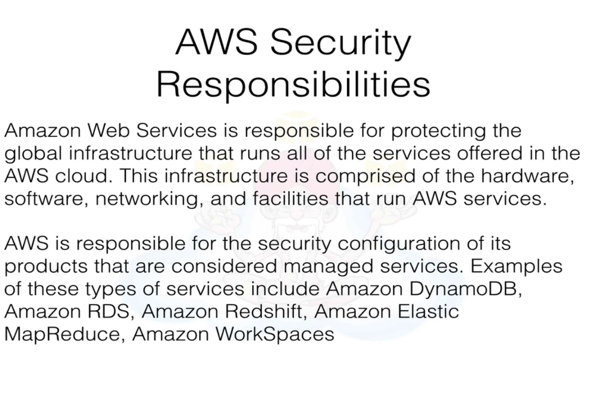
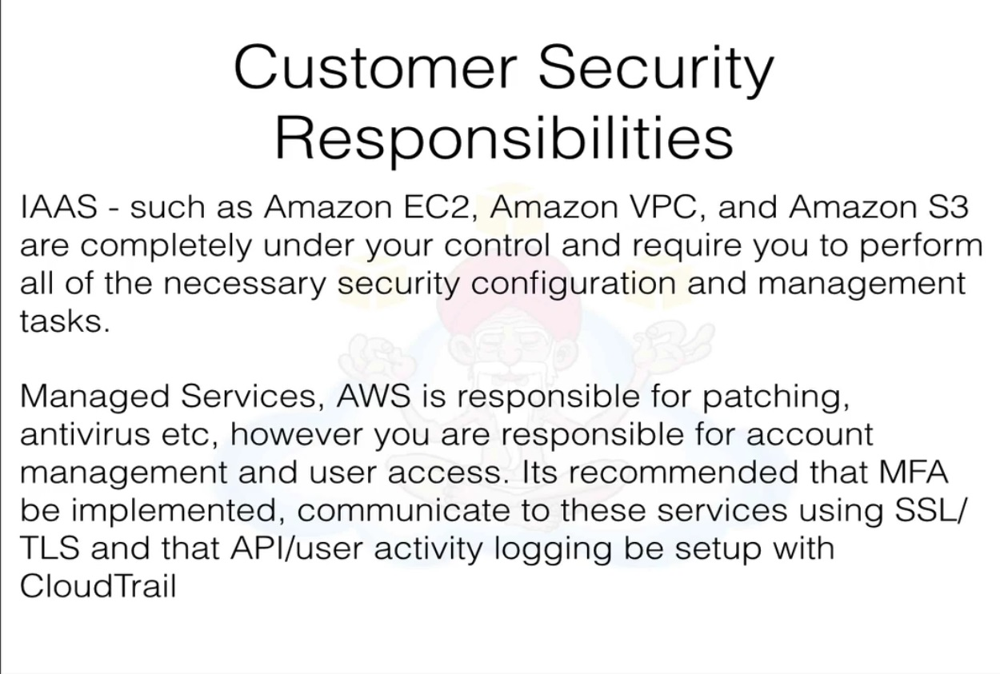
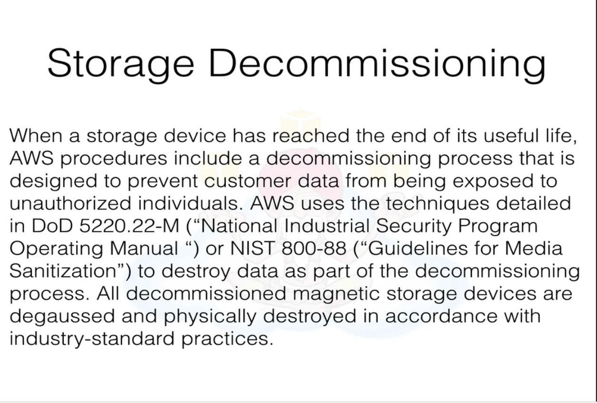
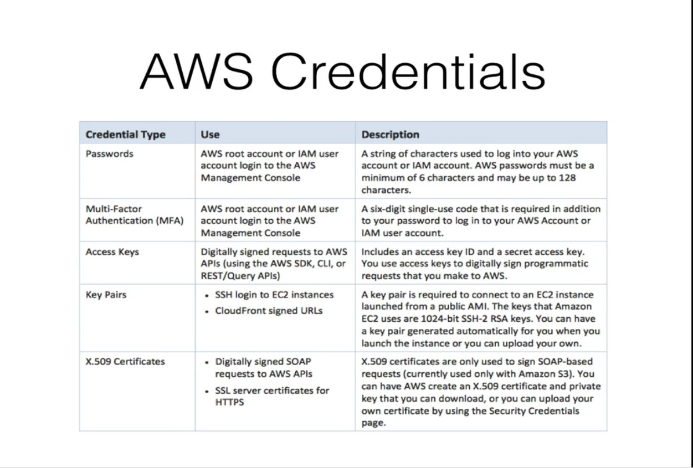
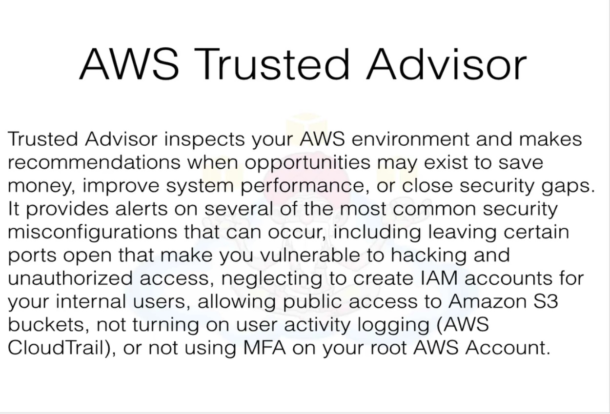

# Overview of AWS whitepapers

## Section 11, Lecture 85

* What is cloud computing
 Cloud computing is the on demand delivery of IT resources and applications via the internet with pay as you go pricing. Cloud computing 
 offers a simple way to access servers, database, storage and a broad set of application services over the internet. Cloud computing 
 providers such as aws own and maintain the network connected hardware required for these application services, while you provision and 
 use what you need using a web application
 
 * 6 Advantages of Cloud
  * Trade capital expense for variable expense
  * Benefit from massive economies of scale.
  * Stop guessing about capacity
  * Increase speed and agility
  * Stop spending money running and maintaining datacentres
  * Go global in minutes.

* Aws has infra in 11 regions and mostly 3 availability zones in every region and one AZ in china.

* Security
 * State of art electronic surveillance and multi factor access control systems
 * Staffed 24 x 7 by security gaurds
 * Access is authorized on least privilege basis.

* Compliance
 * PCI DSS Level 1 
 * ISO 27001
 * FISMA, DIACAP and FedRamp
 * SOC3
 * SOC2
 * SOC 1/SSAE 16/ISAE 3402 (formerly SAS 70 Type II)
 
 ## Section 11, Lecture 86 (OverView of Security Process - Part 1) - Most Important whitepaper to read
 
 * This white paper covers 20% of the exam.
 Amazon corporate Segration - Logically the Amazon production network is segregated from the Amzaon Corporate 
 Network by means of complex set of network security segration devices.

 

 
 So there was this question asked, does amazon.com network same as aws network. The answere is no.
 
 * Network monitoring and protection against
  *  DDOS
  * Man in the middle attacks
  * Ip spoofing : The AWS-controlled host based firewall infrastructure will not permit an instance to send traffic with a source IP 
  or mac address other than its own.
   Unauthorized port scans by Amzon EC2 customers are violation of the AWS Acceptable use policy. You may request permission to conduct 
   vulnerability scans as required to meet your specific compliance requirements. These scans must be limited to your own instances and 
   must not violate AWS Acceptable use policy. You must request a vulnerability scan in Advance.
  * Port Scanning
  * Packet Sniffing by other tenants
  
 
 
   
## Section 11, Lecture 87 (OverView of Security Process - Part 2) - Most Important whitepaper to read

## Section 11, Lecture 88 (AWS Risk and complaince)

## Section 11, Lecture 89 (Storage Options in the cloud)

## Section 11, Lecture 90 (Architecting for the AWS Cloud)

 
 

 
