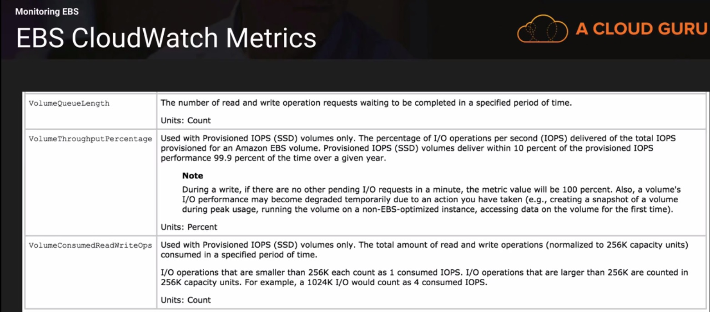
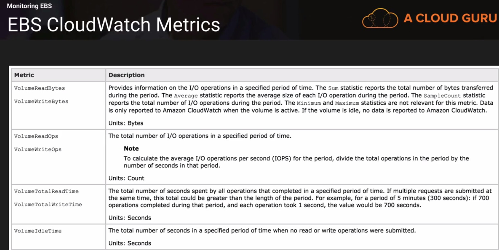
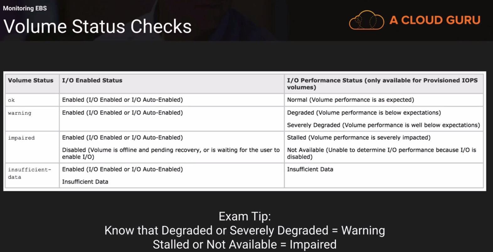
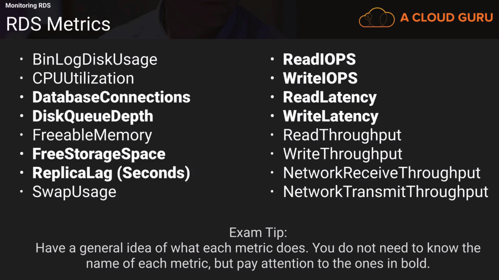
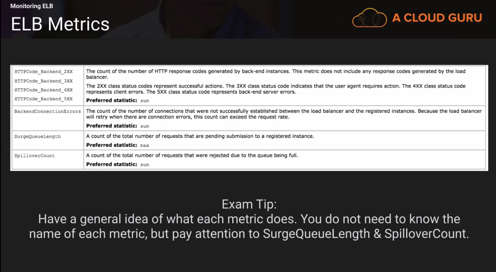

## Domain 1 - Monitoring (worth 10% of the exam)

### Cloudwatch

Apart from the basic services, cloudwatch can monitor

* Route53 health checks
* Storage Gateways
* Cloudfront
* Elastic Map Reduce Job Flows
* Dynamo DB
* SNS Topics
* SQS Topics
* Opsworks
* Cloudwatch Logs
* Estimated Charges on your AWS Bill

#### Host Level Metrics Consists of

* CPU Utilization
* Disk
* Network
* Status Check

Ram Utilization, Disk Storage Utilization is a custom metric and has to be separately configured. Default EC2 monitoring interval is 5 mins, if detailed monitoring is turned on it will make it 1 min.

For custom metrics the mininum granularity that you can have is 1 min.

#### How long are CloudWatch Metrics Stored?

By default metrics are stored for 2 weeks, you can retrieve data that is longer than 2 weeks using the GetMetricStatistics API.

### EC2 Status Checks

* System Status Checks (Checks underlying physical host)
  Can Occur due to:
  * Loss of System Power
  * Loss of network connectivity
  * Software issues on the physical host
  * Hardware issues on the physical host

  In case of system status check stop and start the instance, stopping and starting the VM changes the physical host.

* Instance Status Checks (Checks VM)
  Can occur due to:
  * System Status Checks
  * Misconfigured Network or startup configuration
  * Corrupted File System
  * Incompatible Kernel

  Incase if instance status checks reboot your VM or make modifications to the OS.

### Creating a cloudwatch Role.

Create a role with CloudWatchFullAccess permissions.

### Monitor EC2 using custom Metrics.

Create a custom metric for RAM utilization by downloading the pearl script given in aws documentation and configuring it as a cronjob to run every 5 mins. Note your instance should have permission to push to cloudwatch. You can attach the role created in previous lecture to the EC2 instance.

### Monioring EBS 

Types of EBS Storage:
* General Purpose (gp2)
* Provisioned IOPS (SSD) - io1
* Throughout Optimised (HDD) - st1
* Cold (HDD) - sc1

When your volume requires more than the baseline I/O performance, it simply uses I/O credits in the credit balance to burst to the required performance level, up to a maximum of 3000 IPOS.

* Each volume receives an initial I/O credit balance of 54,00,000 I/O credits.
* This is enough to sustain the maximum burst performance of 3000 IOPS for 30 mins.
* When you are not going over the provisioned IO level (ie) bursting you will be earning credits.

#### Prewarming EBS Volumes

New EBS Volumes receive their maximum performance the moment they are available and donot require initialization. For new volumes created from snapshots, you should read all the blocks that have data before using them to avoid latency of I/O operation.

If your volume is attached to the current Generation EC2 instance then you can increase the size of the volumen, change its type, adjust its performance all without detaching it. This can be done for detached volumes as well.

### Monioring RDS

RDS can be monitored in Two Ways:

* RDS using cloudwatch Metrics
* Using RDS events.

- ReadIOPS	
  The average number of disk I/O operations per second.
  Units: Count/Second

- ReadLatency	
  The average amount of time taken per disk I/O operation.
  Units: Seconds

- ReadThroughput	
  The average number of bytes read from disk per second.
  Units: Bytes/Second

- DiskQueueDepth
  The number of outstanding IOs (read/write requests) waiting to access the disk.
  Units: Count

### Minitoring ELB

ELB records and sends metrics to cloud watch in a 60 secs interval.

* Solution to handle surgeQueueLength is to configure autoscaling or increase the number of backend servers.

### Monitoring Elastic Cache

When it comes to monitoring caching engines there are 4 important things we should look at:
* CPU utilization
* Swap Usage
* concurrent connections
* Evictions

- CPU Utilization:
  * Memcached
    * Multi-threaded
    * Can handle loads of upto 90%. If it exceeds 90% add more nodes to the cluster

  * Redis
    * Not multi-threaded. To determine the point in which to scale, take 90 and divide by the number of cores.
    * For eg, suppose you are using a cache.m1.xlarge node which has 4 cores. In this case, the threshold for CPU utilizaton would be (90/4) or 22.5.

- Swap Usage
  * Typically size of swap file is the size of RAM. If your computer runs out of ram, swap file is used.

  - Memcached
    Swap usage should be 0 and should not exceed 50 MB. If this exceeds 50 you should increase memcached_connections_overhead parameter.
    The memcached_connections_overhead defines the amount of memory to be reserved for memcached connections and other miscellaneous overhead.

  - Redis
    No swap usage metric, instead uses reserved memory.

- Evictions
  An eviction occurs when a new item is added and an old item must be removed due to lack of free space on the system.

  - Memcached
    * There is no recommended setting. Choose a threshold based off your application.
    * Either scale up
    * OR Scale out

  - Redis 
    * There is no recommended setting. Choose a threshold based off your application.
    * Only Scale out (add read replicas).

- Concurrent Connections
  * There is no recommended setting. Choose a threshold based off your application.
  * If there is a large and sustained spike in the number of concurrent connections this can either mean a large traffic spike or your application is nor releasing connections as it should be.

### AWS Organizations & Conslidated Billing

Read from Architect Professional

### AWS Organizations Lab

Can be read later

### AWS Billing Alarms

These can be set if we want our bill to not exceed a certain value. It will send a notification via email. You can have more advanced actions such as an AutoScaling Action or a notification.

### EC2 Cost Optimization

Already covered in Associate.

