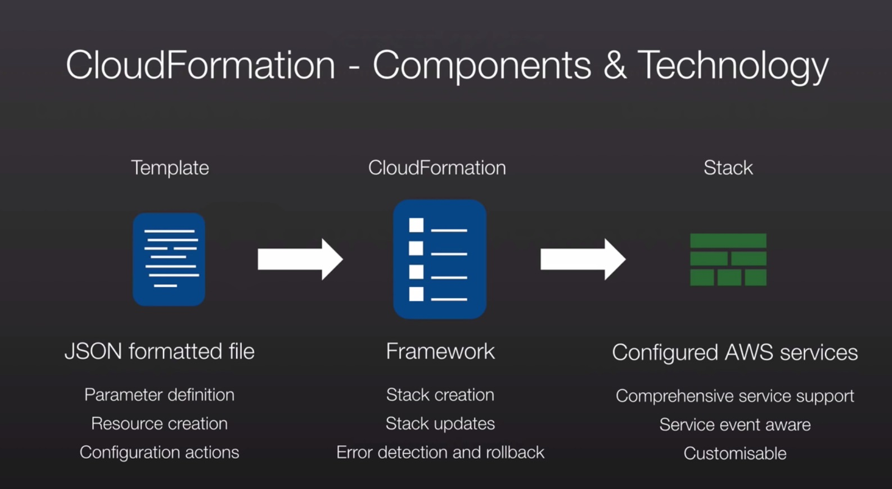

### Cloudformation (Read FAQ's very important)

Cloudformation allows you to take what was once traditional hardware infrastructure and convert it into code.
Cloudformation gives developers and system administrators an easy way to create and manage a collection of related AWS resources, provisioning and updating them in an orderly and predictable fashion. You don't need to figure out the order for provisioning AWS services or the subtlities of making those dependencies work. Cloudformation takes care of this for you. CloudFormation templates can be version controlled the same way you do it for your software application.

Basically cloudformation is a way of scripting your infrastructure.

AWS CloudFormation is a service that helps you model and set up your Amazon Web Services resources so that you can spend less time managing those resources and more time focusing on your applications that run in AWS. You create a template that describes all the AWS resources that you want (like Amazon EC2 instances or Amazon RDS DB instances), and AWS CloudFormation takes care of provisioning and configuring those resources for you.

The following scenarios demonstrate how AWS CloudFormation can help. 

* Simplify Infrastructure Management
* Quickly Replicate Your Infrastructure
* Easily Control and Track Changes to Your Infrastructure

#### AWS CloudFormation Concepts

When you use AWS CloudFormation, you work with templates and stacks. You create templates to describe your AWS resources and their properties. Whenever you create a stack, AWS CloudFormation provisions the resources that are described in your template.

##### StackSet:

A StackSet is a container for AWS CloudFormation stacks that lets you provision stacks across AWS accounts and regions by using a single AWS CloudFormation template.

##### Cloudformation stack vs Template
A cloudformation template is essentially an architectural diagram and a cloudformation stack is the end result of that diagram (i.e what is actually provisioned).A stack is a collection of AWS resources that you can manage as a single unit.
You don't need to figure out the order for provisioning AWS services or subtleties of making those dependencies work. Cloudformation takes care of this for you.

##### Elements of a template

- Mandatory Elements:
List of AWS Resources and their associated configuration values.
- Optional Elements
	- The template file format and version number.
	- Input values that are supplied at the stack creation time.
	- Output values required once a stack has finished building.
	- List of data tables: Used to lookup static configuration values such as AMI's etc.

Template anatomy

```
{
  "AWSTemplateFormatVersion" : "version date",

  "Description" : "JSON string",

  "Metadata" : {
    template metadata
  },

  "Parameters" : {
    set of parameters
  },

  "Mappings" : {
    set of mappings
  },

  "Conditions" : {
    set of conditions
  },

  "Transform" : {
    set of transforms
  },

  "Resources" : {
    set of resources
  },

  "Outputs" : {
    set of outputs
  }
}
```

- Parameters (optional)

Values to pass to your template at runtime (when you create or update a stack). You can refer to parameters from the Resources and Outputs sections of the template.

- Mappings (optional)

A mapping of keys and associated values that you can use to specify conditional parameter values, similar to a lookup table. You can match a key to a corresponding value by using the Fn::FindInMap intrinsic function in the Resources and Outputs section.

- Conditions (optional)

Conditions that control whether certain resources are created or whether certain resource properties are assigned a value during stack creation or update. For example, you could conditionally create a resource that depends on whether the stack is for a production or test environment.

- Resources (required)

Specifies the stack resources and their properties, such as an Amazon Elastic Compute Cloud instance or an Amazon Simple Storage Service bucket. You can refer to resources in the Resources and Outputs sections of the template.

- Resource Properties

Resource properties are the attributes of the resource. Eg An EC2 instance type, ami id, Block Device Mapping etc can be mentioned in resource properties

##### Overview of cloudformation features
* Cloudformation templates can be in YAML or JSON format.
* You can use Fn:GetAtt to output data.
```
"PublicIP":{
	"Description":"Public IP address of the web server",
	"Value":{
		"Fn::GetAtt":[
			"WebServereHost",
			"PublicIp"
		]
	}
}
```
* Chef and Puppet integration
	Cloudformation supports chef and puppet integration as well as Bootstrap scripts.
* Stack Creation Errors
	By default the "automatic rollback on error" feature is enabled. This will cause all AWS resources that AWS cloudformation created successfully for a stackup to the point where an error occured to be deleted. 
* Stacks can wait for Applications
	AWS Cloudformation provides a WaitCondition resource that acts as a barrier, blocking the creation of other resources until a completion signal is received from an external source, such as your application or management system.
* You can Specify deletion policies.
	You can specify that a resource should be preserved and not deleted when the stack is deleted. Eg Amazon S3 buckets.
	You can specify that the snapshots be created for Amazon EBS volumes or Amazon RDS instances before they are deleted.
* Cloudformation can be used to create Roles in IAM and assign it to EC2 instances.
* Cloudformation can be used to create VPC's, subnets, internet gateways, route tables, ELB's etc.
* You can specify IP address ranges both in terms of CIDR ranges as well as Individual IP addresses for specific instances.
* VPC Peering: You can enable VPC peering using Cloudformation, but only within the same AWS account.
* CloudFormation supports Route 53, creation of hosted zones, adding, updating and deleting records.

#### Change Sets

When you need to update a stack, understanding how your changes will affect running resources before you implement them can help you update stacks with confidence. Change sets allow you to preview how proposed changes to a stack might impact your running resources, for example, whether your changes will delete or replace any critical resources, AWS CloudFormation makes the changes to your stack only when you decide to execute the change set, allowing you to decide whether to proceed with your proposed changes or explore other changes by creating another change set. You can create and manage change sets using the AWS CloudFormation console, AWS CLI, or AWS CloudFormation API.

#### Stack Sets

AWS CloudFormation StackSets extends the functionality of stacks by enabling you to create, update, or delete stacks across multiple accounts and regions with a single operation.

#### Reference Function

Reference function is used to avoid Name Space collissions. It allows you to backreference resources that are created within the same template.

#### Literal References

There might be times where you need to reference resources that are created outside of cloudformation. You can use literal references for that.


Here MyExistingSG and mykey are the existing security group and key name which are referenced.
```
{
	"Resources" : {
		"Ec2Instance" : {
			"Type" : "AWS::EC2::Instance",
			"Properties" : {
				"SecurityGroups" : [ { "Ref" : "InstanceSecurityGroup" }, "MyExistingSG" ],
				"KeyName" : "mykey",
				"ImageId" : "ami-7a11e13" 
			}
		}
	}
}
```

#### Referencing input parameters 
The input parameters can be specified at the stack creation time using both the cli or console.

Here KeyPair is referenced in the below example
```
{
	"Parameters" : {
		"KeyPair":{
			"Description" : "The EC2 key pair to allow ssh access to the instance",
			"Type" : "String"
		}
	},
	"Resources" : {
		"Ec2Instance" : {
			"Type" : "AWS::EC2::Instance",
			"Properties" : {
				"SecurityGroups" : [ { "Ref" : "InstanceSecurityGroup" } ],
				"KeyName" : { "Ref" : "KeyPair" },
				"ImageId" : "" 
			}
		}
	}
}
```

#### Conditional Values

If you want to make a template portable across various regions you may want to use different AMI ids in the template. And hence you might need a region to ami mapping for provisioning resources in different regions. You can use Mapping as a mechanism for handling this. In the example below the Ec2Instance Resource uses the FindInMap function to refer to RegionMap mapping and find the appropriate ami value as per the region input.

Here FindInMap is used to locate the map (RegionMap), then it will retrieve the current aws region as AWS::Region is a Pseudo parameter which has the value of current AWS Region and AMI calls the ami id to be used in the region which is picked.

```
{
	"Mappings" : {
		"RegionMap" : {
			"us-east-1" : { "AMI" : "ami-76f0004h" },
			"us-west-1" : { "AMI" : "ami-75f0604h" },
			"eu-west-1" : { "AMI" : "ami-7fd4004h" },
			"ap-southeast-1" : { "AMI" : "ami-7fd9844h" },
			"ap-northeast-1" : { "AMI" : "ami-7fd29404h" },
		}
	},
	"Resources" : {
		"Ec2Instance" : {
			"Type" : "AWS::EC2::Instance",
			"Properties" : {
				"SecurityGroups" : [ { "Ref" : "InstanceSecurityGroup" } ],
				"KeyName" : { "Ref" : "KeyPair" },
				"ImageId" : {
					"Fn::FindInMap" : [ "RegionMap", { "Ref" : "AWS::Region" }, "AMI"]
				} 
			}
		}
	}
}
```

FindInMap is a function in cloudformation which you can use to lookup into mappings.
Mapping is a data structure that you define in your cloudformation template, it is similar to a hash array or Associative array. 
Cloudformation can randomly generate resource names such as an S3 bucket based on the logical id and the stack name. If you use this it improves the portability tremendously.

#### Pseudo-parameters

They are provided by aws via cloudformation and they allow your template to reference certain runtime elements. 

eg. AWS::Region this contains the regions your stack is being created in through the application of your template. Pseudo parameters can be referenced just like normal parameters using the Ref function

#### File and Services Key in Cloudformation templates

File key allows you to write files to the instance filesystem
Services key allows you ensure that the services are not only running when cfn-init finishes; but they are also restarted upon reboot.

#### Adding user data to cloudformation

EC2 expects user data to be base64 encoded, hence we need to use the below Base64 function to pass user data to ec2 in a base64 encoded form. Here we pass the commands to be executed on the ec2 instsance to the Base64 function line by line. We use literal string indicator a pipe to tell Base64 function that anything which follows is a literal string.

```
UserData:
  Fn::Base64 |
    #!bin/bash
    yum install httpd -y
    yum install php -y
```

Fn::Sub Command allows for efficient string substitution. It provides a concise way of adding pseudo or template parameters to a string, We can perform parameter or varaible injection into our UserData text before it is passed to the Base64 function for encoding 

Following sample shows how parameters can be substituted in the user data string

```
UserData:
  Fn::Base64 |
    #!bin/bash
    yum install httpd -y
    yum install php -y
    wget https://wordpress.org/latest.tar.gz
    tar -zxvf latest.tar.gz --strip 1
    cp wp-config-sample.php wb-config.php
    sed -i 's/database_name_here/${DatabaseName}/g' wb-config.php
    sed -i 's/localhost/${DB.Endpoint.Address}/g' wb-config.php
    sed -i 's/usernamename_here/${DatabaseUser}/g' wb-config.php
    sed -i 's/password_here/${DatabasePassword}/g' wb-config.php
```

In the above example DatabaseName,DatabaseUser,DatabasePassword are the parameters which are substituted in the UserData function. Here DB.Address is the hostname of the db logical resource and are secondary attributes. Just understand that DB logical resource here has a primary attribute that a will be returned if you use REF fucntion. 

You can use "DependsOn" attribute in your template if your want to stall other resource creation till a particular resource has been created. Example you want to create EC2 instances only after the DB instance is created. But if use use attributes of one resource as the values for other resource in our cloudformation template, the stack creation automatically waits till the primary resource is created.

You can use the below mentioned link for "DependsOn" usage

https://docs.aws.amazon.com/AWSCloudFormation/latest/UserGuide/aws-attribute-dependson.html

#### CloudFormation Reference Stacks

In a cross reference stack you export parameters from one stack which can be used by another stack. Cross-stack references let you use a layered or service-oriented architecture. Instead of including all resources in a single stack, you create related AWS resources in separate stacks; then you can refer to required resource outputs from other stacks.

For example, you might have a network stack with a VPC, a security group, and a subnet for public web applications, and a separate public web application stack. To ensure that the web applications use the security group and subnet from the network stack, you create a cross-stack reference that allows the web application stack to reference resource outputs from the network stack. With a cross-stack reference, owners of the web application stacks don't need to create or maintain networking rules or assets.

In a cross reference stack you export parameters from one stack which can be used by another stack.


* Export name should be unique in that region in that account. Since cloudformation is a region based service.
```
Export:
  Name: sharedvpc
``` 
* It cannot have Cross-Region References.
* Cant modify or remove a referenced value if it is imported in another stack.
* We can import exported values from other stacks to fill up for parameter values. use 
```
VpcId: !ImportValue sharedvpc
```

Difference between Nested Stacks and Cross Stack Referencing.

Stack nesting relies on the application of the parent stack which creates some resource and then creates a child stack.
Certain stack operations, such as stack updates, should be initiated from the root stack rather than performed directly on nested stacks themselves. Using reference stacks we can update independent stacks which will limit our update or creation scope to that particular stack and other components will not be affected.
With Cross stack reference if you use same resources in two stacks they won't be created twice instead it will shared, with nested stack both the stack will create and have separate resources and won't be shared. 

https://cloudacademy.com/blog/understanding-nested-cloudformation-stacks/


#### Lambda usage in Cloudformation

When lambda is invoked by any object it receives the event object and context object.
Context: Contains Methods and attributes. It's used to allow the function to obtain certain information about its invocation. We can query attributes of the context object to know the function name. Or the assess the memory limit in MB's or the log group. Context is important it allows the function to see meta-data relating to its invocation or its runtime environment.
Event: One or more records.

#### Custom Resources

Custom resources have properties(inputs) and attributes (outputs) just like any other cloudformation resource + service tokens. A service token is an endpoint address. Custom Resources allow you to extend cloudformation to external or non aws resources. Custom services interact with AWS service providers, viz SNS and Lambda, both of which have endpoints. So the custom resource service token points to either SNS or lambda endpoint.	

#### CloudFormation Best Practises:

* Use Cross-Stack References to Export Shared Resources

* Use IAM to Control Access
* Reuse Templates to Replicate Stacks in Multiple Environments:
	To make templates reusable, use the parameters, mappings, and conditions sections so that you can customize your stacks when you create them. For example, for your development environments, you can specify a lower-cost instance type compared to your production environment, but all other configurations and settings remain the same.
* Use Nested Stacks to Reuse Common Template Patterns:
	For example, assume that you have a load balancer configuration that you use for most of your stacks. Instead of copying and pasting the same configurations into your templates, you can create a dedicated template for the load balancer. Then, you just use the AWS::CloudFormation::Stack resource to reference that template from within other templates.
* Create Change Sets Before Updating Your Stacks
* Use Stack Policies:
		Stack policies help protect critical stack resources from unintentional updates that could cause resources to be interrupted or even replaced. A stack policy is a JSON document that describes what update actions can be performed on designated resources. Specify a stack policy whenever you create a stack that has critical resources.

		During a stack update, you must explicitly specify the protected resources that you want to update; otherwise, no changes are made to protected resources. 
* Use AWS::CloudFormation::Init to Deploy Software Applications on Amazon EC2 Instances
* CloudFormation Helper Scripts Reference
	Currently, AWS CloudFormation provides the following helpers:
	- cfn-init: Cloudformation init is a feature rich way of providing configurations to ec2 instances. Used to retrieve and interpret the resource metadata, installing packages, creating files and starting services.
		- cfn-init is os independent, if we ask it to install a package it will attempt do it on what ever operating system it is running on. That is a major benefit over standard cloud init or UserData. 
		- Its a desired-state engine - not procedural. Here we give the function in what state we want a particular resource to be in, we donot give it procedural instructions. If you provide procedural steps those steps are executed each time the script is run, with the desired state engine if you are asking a resource to be in a specific state and its already in that state you don't rerun the directives it just confirms that state.
		- Its supports config sets. Instances can be directed to select an appropriate set and have it read the desired state of instructions based on that.
			You can install users, packages, execute commands, sources, create users and groups, modify files using the config: key sections.
			
			

		- Services key in config sets works on linux and windows.It assumes sysvinit on the former and windows service manager on the latter.
			
		

		- Sources,Commands,files and services contain items which if changed, cfn-init will trigger a service restart. Cfn isn't a run once architecture, it is triggered on stack updates.  

		- Order is Significant. You have have certain things executed befor other things.
		- Allows control of timing.
		- Allows authentication.
		- Cfn is idempotent.
		
		```
		/usr/bin/easy_install --script-dir /opt/aws/bin https://s3.amazonaws.com/cloudformation-examples/aws-cfn-bootstrap-latest.tar.gz
		```
	- cfn-hup: A daemon to check for updates to metadata associated with the resource and execute custom hooks when the changes are detected.
		
		cfn-hup is a process which runs on a resource in this case an instance. It listens to changes to the cloudformation mata-data associated with that instance. When a change occurs i.e when a stack update occurs cfn-hup can be configured to act on those changes, running an arbitrary command which for instance can be rerun of cfn-init used to reconfigure the instance based on desired state. 

		First step is to get the cfn-hup setup configured and running.Its configuration is stored in 2 files
		1) /etc/cfn/cfn-hup.conf - This stores, stack id, region, polling times and logging levels.
		2) /etc/cfn/hooks.d/cfn-auto-reloader.conf - This contains a trigger, i.e when does the hook run, possible values are stack creation,update and deletion, it also defines the metadata path to check for any changes to the resource and action to perform when that change occurs. 

		The above can be configured in the services section of the config key.

	- cfn-signal: The cfn-signal helper script signals AWS CloudFormation to indicate whether Amazon EC2 instances have been successfully created or updated. If you install and configure software applications on instances, you can signal AWS CloudFormation when those software applications are ready.
	You use the cfn-signal script in conjunction with a CreationPolicy or an Auto Scaling group with a WaitOnResourceSignals update policy i.e WaitCondition resource.
	- cfn-get-metadata: A wrapper script making it easy to retrieve either all metadata defined for a resource or path to a specific key or subtree of the resource metadata.
	

#### Cloudformation Creation policies

We need a way to signal to cloudformation when a resource is actually ready for service and to have cloudformation to wait until that point before changing  the stack status to create complete and this functionality is added by creation policies. It allows us to influence cloudformation, we can wait for some operation or user defined event to occur before signaling to the stack that the creation has completed successfully.   

eg. a testing framework might run some automated functionality on the instance after the privisioning is complete and signal cloudformation that the process has passed or failed.

Creation Policies contain a number of configurable elements. A count of number of signals it needs to receive. And it has a timeout, the length of time it will wait for the success or failure before assuming failure.
cfn-signal is used to signal a stack. You need to supply the stack name resource and region. 

Sample templates can be found in 105-CreationPolicies folder.

#### Cloudformation Deletion policies - PER Resource

* The 3 options for deletion policy are Delete // Retain // Snapshot.
* Snapshots are supported only for a few resource types and are mentioned in the link below:
  https://docs.aws.amazon.com/AWSCloudFormation/latest/UserGuide/aws-attribute-deletionpolicy.html
* RETAIN is supported by all resource types. (Its leaves the resource as-is after stack deletion).

Sample templates can be found in 106-DeletionPolicies

#### Intrinsic functions
Intrinsic functions allow for run time processing. Run time processing is injecting values into the stack creation template dynamically at runtime. Run time processing is enabled through intrinsic functins and parameters. Intrinsic functions are the ones which allow processing apart from referencing parameter.


* Ref: Ref we use Ref function to reference a parameter.
* GetAZs : Gives a list of AZs in a Region.
* Fn::Select: This function lets you select a value from an array such as GetAZs and pass it to the template or other functions.
* Fn::Join : This lets you join multiple strings using a delimiter.
* Fn::Equals : It takes 2 values, which are compared and retruns binary type true or false. A ! can be wrapped around the equal to revert the result.
* Fn::And : Takes 2,10 input values. returns true if all are satisfied
* Fn::Or : Returns true if either of the 10 values is true.


##### Conditional Functions

* Fn::If : It can be used to evaluate a condition to true or false. In short it works like a ternary operator.
* AWS:NoValue : Aws NoValue is used to eliminate a parameter from the defined template in runtime if the value passed to the parameter is blank.

Below is an example of If function and NoValue used in combination


#### Parameter Constraints

Parameter contranins are useful to prevent attacks like bobby tables.

Input should be checked using the following directives to prevent attacks:

1. AllowedPattern: "[a-zA-Z][a-zA-Z0-9]*". This allows to define regex for accepted input string values
2. NoEcho: true. Doesn't display password on screen
3. MaxLength,MinLength: Allows input length validation.

#### Cloudformation Service Roles

You may have multiple teams within your business. You might have a Support/Ops team and you want to give them permission to just update stacks and then you have an Infrastructure team which has the admin access and can create stasks. Cloud formation lets you achieve this using service roles.

If you donot have access to create aws resources mentioned in cloudformation template you cannot create stacks. You even need access to create,update and delete stacks as well as to upload templates on S3 for stack operations. A sample template is attached in supportpolicy.json 

You can create a cloudformation role which has access to create resources and attach it during the stack creation time. When the stack is being created cloudformation contacts AWS STS service and gets temporary credentials which will be used to create the resources in the stack. This role is attached to the stack itself and a user just having basic cloudformation privileges (not resource creation) can then create stacks as the role is injected into the template.

A role in AWS has two elements, it has the trust policy and the access policy. A role is not an object you can link to anything in aws. An Object or a principle in aws eg a service or a user can assume the role.
Trust policy mentions that a particular service can assume an sts role.

Stack roles and Stack policies: By adding a stack policy in additon to the stack roles, you can limit the extent of changes that can be made to the stack.

#### Cloudformation Auto Subnet Creation

Steps:

* Create a custom resource in cloudformation which is called autosubnet.
* This resource has a services token (endpoint) which is the lambda arn.
* Upload the code to create and update subnets automatically into an S3 bucket, such that lambda would be able to download and execute it.
* Create a role for lambda function to create and update dynamodb table and to read from S3.
* When you upload the autosubnet.yaml (autosubnet custom resource) it invokes the lambda function which checks for available subnets and creates a dynamodb table. The id and attributes of this custom resource are exported to the environment stacks, which import them using reference stacks.
* When you upload an application environment template it calls the custom resource and makes an entry into the dynamodb table for the allocated subnet cidr's for this application.

#### Exam tips
* Cloudformation - big topic in the exam
* Know all the services that are supported.
* Remember what is mandatory for a template - "Resources"
* You can create multiple VPC's inside one template
* You can enable VPC peering using cloudformation but only within the same AWS account.
* Chef,Puppet and bootstrap scripts are supported.
* You can use Fn:GetAtt to output data

#### AWS Cloudformation masterclass webinar notes



##### Troposphere (https://github.com/cloudtools/troposphere)

troposphere - library to create AWS CloudFormation descriptions
The troposphere library allows for easier creation of the AWS CloudFormation JSON by writing Python code to describe the AWS resources. troposphere also includes some basic support for OpenStack resources via Heat.
To facilitate catching CloudFormation or JSON errors early the library has property and type checking built into the classes.

#### Watch and read these resources for cloudformation:

https://aws.amazon.com/cloudformation/aws-cloudformation-articles-and-tutorials/
https://www.brighttalk.com/webcast/9019/105175?channel=CP
