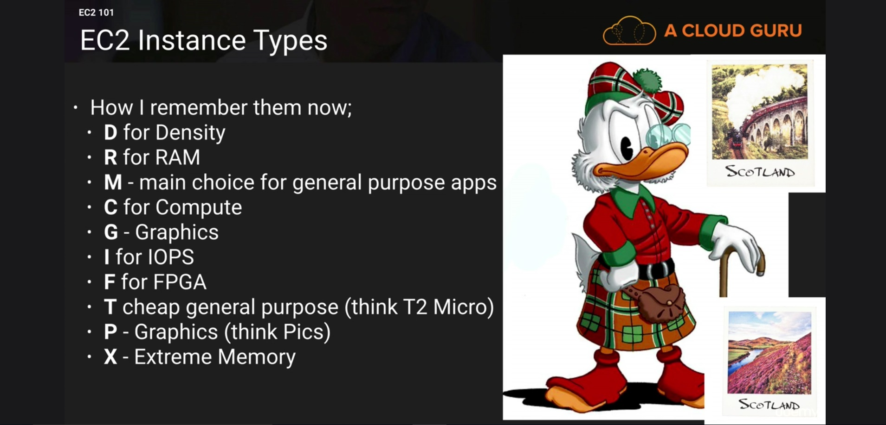

## Domain 2 (worth 10% of the exam)

### Cross Account Access

Cross account access makes it easier to manage multiple accounts with a single AWS IAM user, wherein customers use separate accounts for production and development purposes. You just have to switch roles to login to another account without the need to enter username and password. This separation allows them to cleanly differentiate types of resources and can also provide some security benefits.

#### Steps to create a cross account access:
- Identify the account numbers
- Create a group "Developers" in the dev account
- Create a user "John" in the dev account and add it to the Developers group.
- Login to the production account
- Create S3 bucket called as acloudguru-sharedbucket.
- Select "Create your own policy". Create a policy "read-write-app-bucket" in the production acccount. In the description add "This allows my developers to write to a specific bucket in the production account". Then we need to add a policy document in the json format. Copy the policy provided in the resources and replace the bucket name in the resource ARN.
- Create a role "MyDevelopersAccess" which would be a cross account role. You would need to add the account id of the developer account here.
- Apply the newly created policy to the above role.
- Login into the Dev Account
- Create an inline policy on the Developers group. Use the custom policy option. The policy sample is again provided in the resources section. Policy action would be "sts:AssumeRole". Replace the value for the Resource key with the production account number and the "MyDeveloperAccess" role we created in production account.
- Apply it to the developer group
- Login as John
- Switch Accounts 

### AWS ORGANIZATIONS & CONSOLIDATED BILLING.

#### AWS Organizations
AWS Organizations is an account management service that enables you to consolidate multiple aws accounts into an organization that you create and centrally manage.

Consolidate billing would be useful to apply EC2 reservations and combined S3 storage across multiple accounts.
Eg. Say you have 5 EC2 RI's in an account "A" and only 3 EC2 instances running, then say in another account "B" you have 4 EC2 instances running with no RI's. If consolidate billing is enabled the remaining 2 RI's in account "A" will automatically apply to the resources in Account "B" while the bill is being calculated. Same is the case with S3, while calculating the cost of Storage combined storage for all the accounts is considered which reduces the cost.  

##### Best Practises
- Always enable multi factor authentication on root account
- Always use strong and complex password on root account.
- Paying account should only be used for billing purposes, donot provision resources into paying account.

##### Other thing to note
- As of now you can have only 20 linked accounts. To add more raise a request.
- Billing alerts can be set on paying account as well as individual accounts.
- CloudTrail is per AWS account and is enabled per region.
- Logs can be consolidated to an S3 bucket.

### AWS ORGANIZATIONS LAB

Watch the lab to create and add accounts under an organization and apply policies. Polices either whitelist or blacklist usage of resources under an OU.

### AWS Tagging and Resource Groups

#### TAGS
Tags are key value pairs attached to resources. 

#### Resource Groups

Resource groups make it easy to group resources using the tags that are assigned to them. You can group resources that share one or more tags. Resource groups can track resources that belong to a particular team, entity or department. AWS Tagging and groups makes it easier to identify and monitor who is using what.

Resource groups contain information such as:
- Region
- Name
- Health Checks
- Public and private ip address
- RDS engine types
- ports configured.

There is a tag editor option in resource groups which can be used to identify and tag untagged resources. It can be used to identify and tag all resources such as volumes, ec2 and rds instances etc.

### AWS Pricing EC2 and RDS

#### EC2 pricing models

Ondemand: Hourly usage
  - Applications with short term, spiky, or unpredictable workloads that cannot be interrupted.

Rerved: Capacity reservation for 1-3 yr term
  - Application with steady state or predictable usage

Spot: enable you to bid whatever price you want for instance capacity.
  - Application that have flexible start and end times
  - Applications that are only feasible at very low compute prices.
  - Users with urgent computing needs for large amounts of additonal capacity.

Dedicated: EC2 instances that run on hardware that's dedicated to a single customer.

##### Types of RI's

- Standard :
  These provide the most significant discount (upto 75%) and are best suited for steady state usage
- Convertible :
  These provide a discount (upto 45%) and the capability to change attributes of the RI as long as the exchange results in the creation of Reserved instances of equal or greater value.
- Scheduled :
  These are available to launch within the time window you reserve. This option allows you to match your capacity reservation to a predictable recurring schedule that only requires a fraction of a day, a week, or a month.

##### Convetible RI's
* Change instance famalies,Operating system, tenancy and payment option.

#### Normalization Factors

Each Reserved instance has an instance size footprint, which is determined by the normalization factor of the instance type and the number of instances in reservation. 

Below is the table for normalization factor:

|Instance Size |Normalization Factor|
|--------------|----------------------|
|Micro|0.5|
|Small|1|
|Medium|2|
|Large|4|
|xlarge|8|
|2xlarge|16|
|4xlarge|32|
|8xlarge|64|
|10xlarge|80|
|16xlarge|128|
|32xlarge|256|

Lets say you already own an RI for a c4.8xlarge. This RI now applies to any usage of a Linux/Unix C4 instance with shared tenancy in the region. This could be

* 1 c4.8xlarge instance
* 2 c4.4xlarge instance
* 4 1 c4.4xlarge instance
* 16 c4.large instance

It also includes other combinations such as one c4.4xlarge and eight c4.large instances.
If you own a RI that is smaller than the instance that you are running, you will be charged the pro-rated, on demand price for the excess. This means that you could buy an RI for a c4.4xlarge use that instance most of the time, but scale upto a c4.8xlarge instance on occassion.

#### RDS - Reserved Instances
* Each Reservation can be applied to the DB instance with the same attributes for the duration of the term.
* You can have reserved instances for both Multi AZ and Read Replicas
* For Read Replicas the DB instance class and region must be the same.
* Reservation can however be used in any of the available AZ's within the associated Region.

Understand the different use cases of  Ondemand, Reserved and Spot Instances.

Most commercially or financially feasible option of designing a solution would be spot instances but technically it won't be the best option as there are chances of data loss. Study and List down the use cases from the Associate exam.

### Knowing your EC2 instance types.

