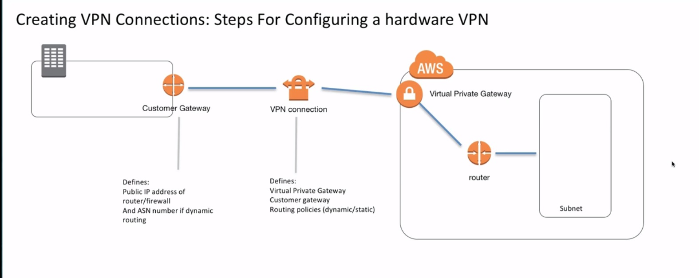
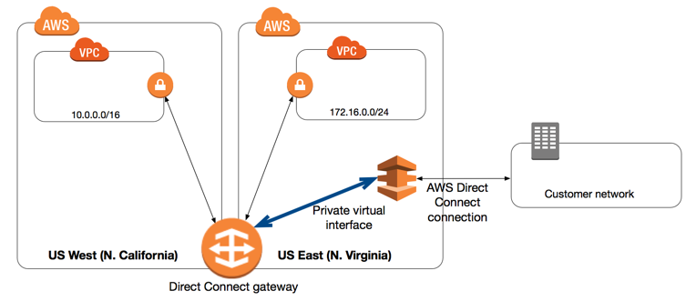
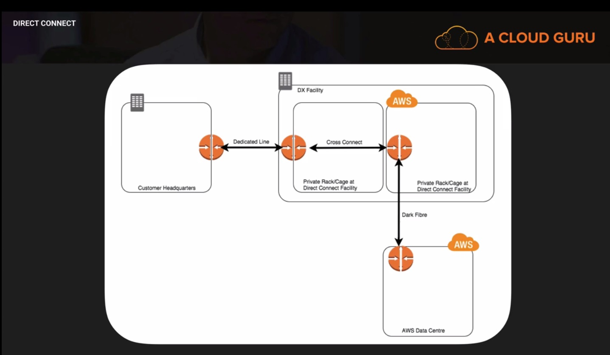
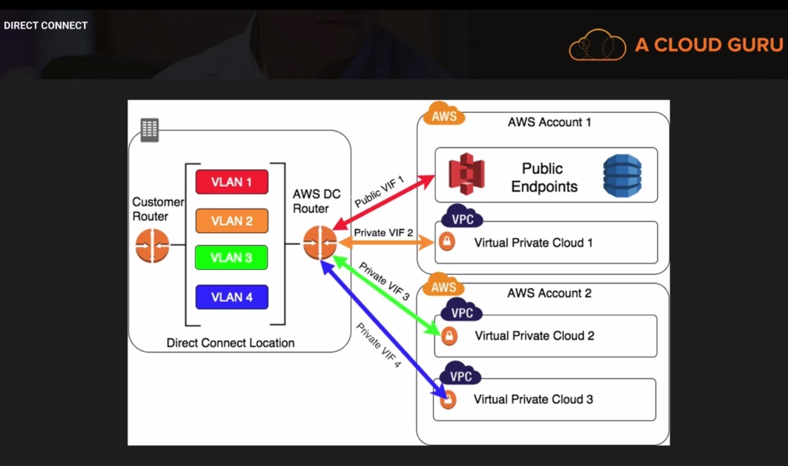

## Domain 4 (worth 10% of the exam)

### VPC Refresher

* What is a VPC
* How to build your own VPC
* How to make a subnet public
* How to make a subnet private
* What a NAT is
* What a route table is
* Subnets can communicate with each other by default.

### Build Own Custom VPC

* If the VPC tenancy is selected as dedicated, then the EC2 instances provisioned under that VPC would be  on a dedicated hardware. However dedicated is a lot more expensive.
* A route table is automatically created when we create a VPC.
* Only one internet gateway per VPC. 

### NAT LAB

* Disable source destination check.
* Provision the nat instance in public subnet and attach the NAT instance to the default or private route table.

### VPC peering refresher

* Transitive Peering is not supported.
* You can create a VPC peering connection between your own VPCs, or with a VPC in another AWS account. The VPCs can be in different regions (also known as an inter-region VPC peering connection).
* AWS uses existing infrastructure of a VPC to create a VPC peering connection; it is neither a gateway nor a VPN connection, and does not rely on a separate piece of physical hardware. There is no single point of failure for communication or a bandwidth bottleneck.
* Soft Limit of 50 VPC peers per VPC, can be increased to 125 by request.
* Cannot create VPC peering between VPC that have overlapping CIDR blocks.
* A placement group can span peered VPCs; however you won't get full bandwidth between instances in peered VPCs.
* A security group in one VPC can be referenced by another security group in the peered VPC.
* Private DNS values can be resolved between instances in the peered VPCs.

### VPC flow logs

These can be enabled for your VPC, Subnet or enis on an EC2 instance.
Flow logs need a role which can be used to push logs to cloudwatch logs. Then set cloud watch alarms based on those logs.

It can be used to detect whether there were unsuccessful login attempts on an ec2 instance.
So for any of the service if rejections start occuring you need to know, this is where you would use VPC flow log alarms.

### Extending an on premise network using a VPN

* Most corporate companies have hardware routers that are used to create VPN connections to the VPC and currently only hardware routers are supported by the VPN VPC option
* Software VPN such as OpenVPN can be configured on an EC2 instance. We can connect to this EC2 instance, create static routes that enable us to connect to our VPC subnets.

#### Creating VPN connections: Key Knowledge

* Understand how to create a hardware vpn connection
* understand how to configure route discovery between on premise and VPC CIDR blocks.

#### Steps for configuring a hardware VPN

* Create a VPG and attach it to VPC. Only one VPG can be attached to a VPC at a time.
* Create a customer gateway, this is a physical device or software on the client side of connection.
  * Requires a public IP address to the on premise router and an ASN number if you enable dynamic routing.
    * Dynamic routing used with BGP will automatically discover on-premise and VPC CIDR blocks and create routes for traffic to communicate between themyour.
    * Static routes are required if BGP is not enabled and requires manual configuration.
* Create a VPN connection in the VPC
  * VPN connection is where the configuration for either static or dynamic routes is configured.

Creating Redundancy

* Each VPN has two tunnels associated with it that can be configured on the customer router.
* The single point of failure then becomes the customer router
  * Create a second customer gateway and a second on premise router for the configuration

### Security Zones

What if you are running multiple applications in an AWS environment?

* Separate by creating multiple VPCs one for each zone (if high level separation is allowed and the apps donot need to communicate)
* For apps/instances that need to communicate, use segmentation tools available to ensure only traffic required is flowing in and out of the zones.
  * Security Groups
  * NACLS
*  Segment environments based of CIDR block ranges and create NACL rules that allow traffic to specific subnets/security groups based of those CIDR block ranges.

### Direct Connect (Read Documentation and FAQ's)

AWS Direct Connect makes it easy to establish a dedicated network connection from your premises to AWS. Using AWS Direct Connect, you can establish private connectivity between AWS and your datacenter, office or colocation environment, which in many cases can reduce network costs, increase bandwidth throughput and provide a more consistent network experience than internet based connections.

AWS Direct Connect lets you establish a dedicated network connection between your network and one of AWS Direct Connect locations using the industry standard 802.1 q VLANs, this dedicated network can be partitioned into multiple network interfaces also called as VIFs.

This allows you to use the same connection to access public resources such as objects stored in S3 and resources in Amazon VPC while maintaining separation between public and private environments. 

VIFs (Virtual Interfaces) can be either Public or Private. Public VIFs can be used to connect to EC2 instances with Public IPS, S3 endpoints, Dnyamodb etc. Private VIFs can be used to connect to EC2 instances or resources in a VPC. Each Direct Connect to VPC connection would need a separate VIF. So if you have 3 VPCs in your AWS account you would need 3 VIFs to connect from your DirectConnect Location. 

#### Direct Connect Benefits

* Reduce costs when using large volumes of traffic
* Increases reliability
* Increases bandwidth

#### How is Direct Connect different from VPN?

VPN connections are good solution for immediate need, have low to modest bandwidth requirements and can tolerate the inherent variability in the internet based connectivity.

AWS Direct Connect does not involve the internet. Instead it uses dedicated, private network between your environment and Amazon VPC.

Direct Connect Connections are available in:
- 10 Gbps
- 1 Gbps
- Sub 1 Gbps can be purchased through AWS Direct Connect Partners.
- Uses Ethernet VLAN trunking (802.1Q).
- This dedicated connection can be partitioned into multiple virtual Interfaces (VIFs).
- Its allows public connections to EC2 or S3 using Public IP addresses.
- It allows private connections to VPC using internal IP addresses.

Direct connect is not fault tolerant. If you need redudancy, you can use a site to site VPN and set it up using a BGP to failover automatically from Direct Connect to Site to Site VPN.

#### Accessing a Remote AWS Region
AWS Direct Connect locations in public regions or AWS GovCloud (US) can access public services in any other public region (excluding China (Beijing)). In addition, AWS Direct Connect connections in public regions or AWS GovCloud (US) can be configured to access a VPC in your account in any other public region (excluding China (Beijing)). You can therefore use a single AWS Direct Connect connection to build multi-region services. All networking traffic remains on the AWS global network backbone, regardless of whether you access public AWS services or a VPC in another region.

* Accessing Public Services in a Remote Region

To access public resources in a remote region, you must set up a public virtual interface and establish a Border Gateway Protocol (BGP) session.

After you have created a public virtual interface and established a BGP session to it, your router learns the routes of the other public AWS regions. 

* Accessing VPCs in a Remote Region
  
  * You can create a Direct Connect gateway in any public region and use it to connect your AWS Direct Connect connection over a private virtual interface to VPCs in your account that are located in same or different regions.

  You associate a Direct Connect gateway with the virtual private gateway for the VPC, and then create a private virtual interface for your AWS Direct Connect connection to the Direct Connect gateway. You can attach multiple private virtual interfaces to your Direct Connect gateway.

  A Direct Connect gateway is a globally available resource. You can create the Direct Connect gateway in any public region and access it from all other public regions.

  In the following diagram, the Direct Connect gateway enables you to use your AWS Direct Connect connection in the US East (N. Virginia) region to access VPCs in your account in both the US East (N. Virginia) and US West (N. California) regions.  

  

  * Alternatively, you can create a public virtual interface for your AWS Direct Connect connection and then establish a VPN connection to your VPC in the remote region.

#### BGP - Border Gateway Protocol

Border Gateway Protocol (BGP) is a standardized exterior gateway protocol designed to exchange routing and reachability information among autonomous systems (AS) on the Internet.
The Border Gateway Protocol makes routing decisions based on paths, network policies, or rule-sets configured by a network administrator and is involved in making core routing decisions.

BGP4 is standard for Internet routing, required of most Internet service providers (ISPs) to establish routing between one another.

- One of the pre requisites for virtual interfaces:

BGP information: A virtual interface must have a public or private Border Gateway Protocol (BGP) Autonomous System Number (ASN) for your side of the BGP session. If you are using a public ASN, you must own it. If you are using a private ASN, it must be in the 64512 to 65535 range. Autonomous System (AS) prepending does not work if you use a private ASN for a public virtual interface. You can provide your own MD5 BGP authentication key, or you can let Amazon generate one for you.

#### CGW vs VPG

When using a VPN you need an anchor on each side of that connection. A Customer Gateway is the anchor on your side and it can be physical or a software appliance.

The anchor on the AWS side of the VPN connection is called a Virtual Private Gateway.

#### Key Points to Remember

- If you are accessing public services using https endpoints (think DynamoDB, S3) then use public VIFs.
- If you are accessing VPCs using private IP address ranges, the use private VIFs.
- Direct Connect itself is not redundant. You can add redundancy by having 2 connections (2 routers, 2 direct connects), or by having a site-to-site VPN in place.
- Layer 2 connections are not supported.

### HPC and Enhanced Networking.

High Performance compute is generally used by many different industries, such as the pharmaceutical or automative industries. HPC typically involves:
- Batch processing with large and compute intensive workloads
- Demands high performance CPU, Network and Storage.
- Usually Jumbo frames are required.

Jumbo Framers are ethernet frames with more than 1500 bytes of payload. A jumbo frame can carry upto 9000 bytes of payload.

Shared file systems such as Lustre and NFS use Jumbo Frames frequently. HPC applications use a lot of disk I/O and need access to a shared file system. this makes jumbo frames critical.

#### SR-IOV

The use of Jumbo frames is supported on AWS through enhanced networking. Enhanced networking is available using single-root I/O virtualization on supported instance types:
- C4
- C3
- M4
- I2
- R3
- D2

SR-IOV is supported on HVM VMs, not PV.

#### Placement Groups

- Logical grouping of instances whithin the same availability Zone.
- Enables applications to participate in low latency, 10 Gbps network.
- Placement groups are recommended for applications that benefit from low latency, high throughput or both.
- for lowest latency and highest packet per second network performance choose an instance type that supports enhanced networking.
- Placement Groups dont span availability zones.
- Placement Groups can span subnets in same AZ.
- Existing instances cannot be moved into Placement Groups.
- Provision placement Group for peak load. you may not be able to add instances later.
- Try to use homogenous instance types.

### ELBs

#### Classic Load Balancer

- You can launch a classic load balancer either in a single or multiple AZ's, but an application ELB has to be launched in Multipe AZ's
- You can create a classic load balancer without a public IP address to serve as an internal load balancer.
- Supports SSL Offloading
- Sticky Sessions
- Support both IPV4 and IPV6
- Supports Layer 4 and Layer 7 loadbalancing
 - You can load balance http/https applications and use layer 7 features, such as X-Forwarded and sticky sessions. You can use strict layer 4 load balancing for applications that rely on TCP protocol.
- Operational Monitoring and Logging available.
- You can use Cloud trail to log all api calls to the ELB

#### Application Load Balancer

- Can route a request to a service behind your ALB based on the content of the request.
- Supports Host based routing: You can route a request based on the host field of the Http header.
- Path based routing: Can route client request based on the url path of the http header.
- Has containerized Application support (integrates with ECS). 
> That allows you to configure an application loadbalancer to loadbalance containers accross multiple ports on a single EC2 instance. Basically use ECS and it allows you to specify a dynamic port in ECS task definition and then it gives the container an unused port when it is scheduled on an EC2 instance and the EC2 schedular automatically adds the task to ALB by using this port.
The Classic Load Balancer requires that you statically map port numbers on a container instance. You cannot run multiple copies of a task on the same instance because the ports would conflict. An Application Load Balancer allows dynamic port mapping. You can have multiple tasks from a single service on the same container instance.
  > - IMP ECS concepts: Amazon EC2 Container Service (Amazon ECS) is a shared state, optimistic concurrency system that provides flexible scheduling capabilities for your tasks and containers. The Amazon ECS schedulers leverage the same cluster state information provided by the Amazon ECS API to make appropriate placement decisions.
 >> - Task Definition: A task definition is like a blue print for your application. Every time you launch a task in Amazon ECS, you specify a task definition so the service knows which Docker image to use for containers, how many containers to use in the task, and the resource allocation for each container. What (if any) ports from the container are mapped to the host container instance.
 >> - Service : A service launches and maintains a specified number of instances of the task definition in your cluster. The Amazon ECS sample application is a web-based "Hello World" style application that is meant to run indefinitely, so by running it as a service, it will restart if the task becomes unhealthy or unexpectedly stops.
 >> - Service Schedular: Amazon ECS provides a service scheduler (for long-running tasks and applications), the ability to run tasks manually (for batch jobs or single run tasks), with Amazon ECS placing tasks on your cluster for you, and the ability to run tasks on the container instance that you specify, so that you can integrate with custom or third-party schedulers or place a task manually on a specific container instance. The service schedular ensures that the specified number of tasks are constantly running and reschedules tasks when a task fails.
 >> - **Note:** The task definition must be set to use host port 0. Because a random port from the instance's ephemeral port range is used, make sure that the security group and NACL settings of the load balancer and the backend instances allow traffic from the load balancer to the instances over the ephemeral port range.

- You can use ALB to configure service autoscaling with ECS
- HTTP/2 Support : Http version 2 supports multiplexing multiple requests over a single tcp connection, which means multiple request can be served over a single connection.
- WebSockets Support : Allows server to exchange message with end users, without the end user having to poll the server for an update. WebSocket is a computer communications protocol, providing full-duplex communication channels over a single TCP connection.
- Native IPV6 Support
- Sticky Sessions
- Health Checks
- High Availability (Works with only multi AZ setup)
- Security Features.
- Integrates with WAF (Web Application Firewall)
- Layer 7 Loadbalancing.
- Delete Protection
- Request Tracing - custom identifier "X-Amzn-Trace-Id" Http header on all requests. You can track requests as they reach or pass through multiple endpoints in your VPC.

#### Classic Load Balancer Tips

* Know which ports ELBs supports
 - [EC2-VPC] 1-65535
 - [EC2-Classic] 25,80,443,465,587,1024-65535
* Cannot assign an EIP to Elastic Load balancer
* IPV4 and IPV6 supported.
* You can load balance to the "Zone Apex" of your domain name.
* You can log all api calls to ELB by turning on cloudtrail.

#### Read FAQs

### Scaling NATs

Bottlenecks can occur when you have a single NAT instance that has too much traffic passing through it. There are several approaches to reducing bottlenecks:

- Scale up
- Choose an instance family that supports enhanced networking.
- Scale out: Only one subnet can route to a NAT at a particular time so add an additional NAT & subnet and migrate half your workloads to the new subnet.
- HA for NATs: You can create HA for NAT instances, but each subnet can only route to 1 NAT at a time. You can failover a subnet to another NAT

Blog on how to do HA for NAT.

https://aws.amazon.com/articles/2781451301784570

- SSL Offloading
- Operational Monitoring
- Logging
- You can use Cloud trail to log all api calls to the ALB

### Domain 4 Wrapup.

Revision for all the above mentioned points.

(Read FAQ's on Direct Connect and VPCs)
