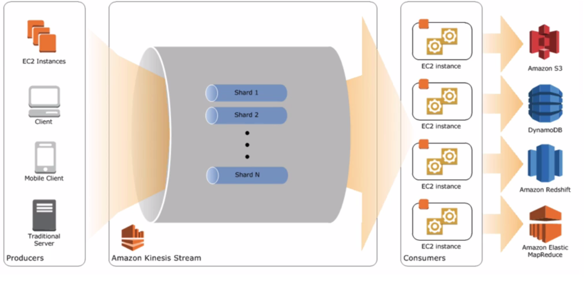

## Domain 7: Scalability and Elasticity (worth 15% of the exam)
(Compulsary Read Cloudfront FAQ's or Developer guide)

### Cloudfront

Amazon cloudfront can be used to deliver your entire website, including dynamic, static, streaming, and interactive content using global network of edge locations.

* Two Types of Distributions:
  * Web Distributions
  * RMTP Distributions

#### Geo Restriction
  * Geo restriction and Geo blocking lets you choose the countries in which you want to restrict access to your content.
  * Countries that are blacklisted would get a 403 access denied message.
  * You can also create custom error pages.

#### Support For
  * CloudFront supports put,post,patch,delete,options,head and get requests.
  * It doesn't cache the responses to put,post,patch and delete requests - these requests are proxied back to the origin server. GET, HEAD and options requests are cached.
  * Cloudfront allows you to specify custom origins including on premise servers and sources.

#### SSL
You can use either HTTP or HTTPS with cloudfront. With SSL you can use the default cloudfront URL or your own custom url with your own SSL certificate.
* Dedicated IP custom SSL: Allocates dedicated IP addresses to serve your SSL content at each cloudfront edge location. Very Expensive $600 USD per certificate per month. However will support older browsers
* SNI Custom SSL: Relies on SNI extention of the Transport layer security protocol, which allows multiple domains to serve ssl traffic over the same IP address by including the hostname viewers are trying to connect to. Older browsers won't support it.

#### CNAMEs are supported
* You can have 10 cnames aliases to each distribution.
* Cloudfront also supports wildcard cnames

#### Invalidation Requests

* Delete the file from the origin. The object on the cloudfron will be deleted when it reaches its expiration period defined in the object header.
* You can use invalidation api to remove the object from all cloudfront edge locations incase the object is to be removed before its speficied expiration time.

#### Zone Apex Support

* Using route 53 you can configure an Alias record that lets you map your apex record to the cloudfront distribution.
* Route 53 doesn't charge you for the Alias record queries that are mapped to a cloudfront distribution.

#### Dynamic content support.

* Supports delivery of dynamic content that is customized or personalized using HTTP cookies. To use this feature you can specify whether you want cloudfront to forward some or all of your cookies to your custom origin server. Amazon cloudfront then considers the forwarded cookie values when identifying a unique object in its cache.
* Cookie values can be logged in access logs.
* Use one cdn for entire site rather than just one for static files.
* Use custom origins and origin rules to determine what part of the website requests go to origin. For eg, images to go to S3 but dynamic content goes to a specific EC2 instance.
* Whole site CDN works with uploads as well, up to 20GB. The edge location acts as a proxy for the uploaded object to the origin with the speed of AWS backend network rather than open internet.

#### Cloudfront Security

* Signed URLs: Provide URLs with expiry dates to limit access to content
* Signed Cookies: You can limit content without limiting access to the URL. For eg if a user is logged in, you can issue a signed cookie that verifies they have permission to access certain parts of the site.
* Configure all HTTP requests to be automatically redirected to HTTPS
* AWS WAF closely integrates with cloudfront.

#### Video Streaming on Cloudfront

Video streaming on Cloudfront is a very useful tool as you can use the CDN to stream video around the world.
Cloudfront supports two different types of streaming on-demand and live streaming and two types of distributions web and RMTP (Real time messaging protocol).

* Distributions:
  * Web
    * You can use web distributions to serve the following content over HTTP or HTTPS:Static and dynamic download content, for example, .html, .css, .js, and image files, using HTTP or HTTPS.
    * Multimedia content on demand using progressive download and Apple HTTP Live Streaming (HLS). For more information, see the applicable topic in Working with Web Distributions.
    You can't serve Adobe Flash multimedia content over HTTP or HTTPS, but you can serve it using a CloudFront RTMP distribution. See RTMP Distributions below.
    * A live event, such as a meeting, conference, or concert, in real time. For live streaming, you create the distribution automatically by using an AWS CloudFormation stack. For more information, see the applicable live-streaming tutorial in CloudFront Streaming Tutorials.
  
  * RMTP
    RTMP distributions stream media files using Adobe Media Server and the Adobe Real-Time Messaging Protocol (RTMP). An RTMP distribution must use an Amazon S3 bucket as the origin.

* Streaming Types:
  * On-Demand Streaming: On-Demand streaming is configured on web cloudfront distributions.
    You can deliver the entire video file to the device before playing it, or you can stream it to the device.

    The first option is very easy to implement and is supported by just about every mobile device and desktop.  All you need to do is to put your content in an S3 bucket and create a CloudFront distribution that points to the bucket. Your user’s video player will use CloudFront URLs (accessible as part of the distribution) to request the video file. The request will be directed to the best edge location, based on the user’s location. CloudFront will serve the video from its cache, fetching it from the S3 bucket if it is not already cached. This option has a couple of downsides. It makes inefficient use of your viewer’s bandwidth. If the user doesn’t bother to watch the entire video, content would never be seen is still downloaded. Skipping ahead or fast-forwarding also necessitates downloading of content that may never be seen.

    The second option is almost always preferred. A newer family of video streaming protocols including Apple’s HTTP Live Streaming (HLS), Microsoft’s Smooth Streaming, (SS) and Adobe’s HTTP Dynamic Streaming (HDS) improve the user experience by delivering video as it is being watched, generally fetching content a few seconds ahead of when it will be needed. Playback starts more quickly, fast-forwarding is more efficient, and the overall user experience is smoother. Mobile users appreciate this option because it doesn’t waste their bandwidth and they get to see the desired content more quickly.

    * Smooth: To enable Microsoft Smooth streaming, create a web distribution and on the custom origin select "Enable smooth streaming"
    
    * Progressive Downloads: Progressive download is the process of transferring digital media files (HLS/MP4) from a cloudfront origin to a client over HTTP/HTTPS

  * Live Streaming
    In the live streaming case, your content represents a live event such as a business meeting, a Mars landing, or a sporting event.

    The streaming server (Wowza Media Server is available in the AWS Marketplace and is a good example) will accept incoming streams from the live event, convert them to the supported streaming protocols, and deliver the content to CloudFront where it will be routed to the audience that’s viewing the live event.

RTMP is a true video streaming protocol. Its only streaming protocol that cloudfront supports. RTMP is flash only streaming. RTMP does not support HTML5 on mobile device.

How does dynamic caching work? What if dynamic content has changed? (doubtful - please verify)

* Set the ttl to 0 IMPORTNAT. What does a TTL of 0 do?
  * It will cache the content eventhough the ttl is 0.
  * when a request is made it will make a GET request to the origin with an "If-modified-since" header to determine if there is new data in the origin, if there is then the new data is requested and cached else the current data is served from the cache.

### Memcached vs Redis

#### Use Memcached if
* You want the simplest model possible
* You need to run large nodes with multiple cores or threads
* You need the ability to scale out or scale in as demand on your system increases or decreases.
* You want to shard your data across multiple nodes.
* You need to cache objects such as a database.
* Memcached supports auto discovery, client programs automatically identify all nodes in a cache cluster. 

#### Use Redis if
* Persisent key value storage.
* If you need automatic Failover such as Multi A-Z required.
* If you require one or more read replicas.
* You need to sort and rank in memory data sets.
* You need complex data type support such as hashes,list,sets and strings.
* You need backup and restore capabilities.
* You want publish and subscribe (pub/sub) capabilities - the client being informed of the events on the server.

Typical Redis usecases include session state management, recommendation data and leader boards. Data with intense calculations and frequently changing data. Memcache is often used for data that changes less frequently.

To Apply persistence to a redis cluster in the event of a Reboot, enable Redis Append Only Files (AOF)
* It is disabled by default
* Will write all commands that change cache to "append-only" file.
* If a node is rebooted and memory is cleared then Redis caching engine loads the AOF and the data is available again.

Memcache can scale horizontally for writes, but Redis behaves much like RDS, to increase the capacity for writes you need to increase the instance size.

We can take snapshot of a redis cluster and launch it into an EC2 instance. However we cannot copy or export a snapshot to another region.

### Kinesis Streams

Amazon Kinesis Streams enables you to build custom applications that process or analyze data for specialized needs. You can add any type of data such as click streams, application log data and social media to amazon kinesis streams from hundreds of thousands of sources. Within seconds the data will be available for your amazon kinesis application to read and process from the stream. 

#### Knesis Key Concepts

* Data Producers
* Shards
* Records	
  * Sequence Number
  * Partition Key
  * Data itself (blob)
* Data consumers.

#### Data Producers.

* Amazon Kinesis Streams API
  * Put Record (Single Record)
  * Put Records (Multiple Records)

* Amazon Kinesis Producer Library (KPL)
  * On Github. By using KPL, customers do not need to develop the same logic every time they create a new application for data ingestion.

* Amazon Kinesis Agent
  * Prebuilt Java Application you can install on you Linux devices.

#### What is a Shard?

A shard is simply the unit of measurement of data when refering to Kinesis.

One shard provides a capacity of 1 MB/sec data input and 2 MB/sec data output. One shard can support upto 1000 put records per sec. You will specify the number of shards when you create a stream. For example, you can create a stream with two shards. This stream has a throughput of 2 MB/sec data input and 4 MB/sec data output and allows upto 2000 puts per second. You can dynamically add or remove shards from your stream as your data throughput changes via resharding.

#### What is a partition Key?

Essentially partiton key specifies to which shard the data belongs to.
A partiton key is specified by the application putting data into the stream.

#### What is a sequence number?

Each data record has a unique sequence number. A sequence number is assiged by streams after you write to the stream with client.putRecords or client.putRecord.

#### Blobs

Data blobl is the data that your data producers add to the stream. The maximum size of a datablob after base64 decoding is 1 MB.

- Data is stored for 24 hours by default within streams and can be increased upto 7 days.
- Use S3, Redshift etc to store processed data for longer term. Kinesis streams is not persistent storage.

#### Data Consumers: Data Consumers are the kinesis Stream Applications which consume and process data stored into Kinesis Shards. 

### SNS mobile push.

You send push notification  messages to both mobile device and desktops using one of the following supported push notification services:

* Amazon Device messaging (ADM)
* Apple push notification service (APNS) for both iOS and Mac OS X
* Baidu Cloud Push (Baidu)
* Google Cloud Messaging for Android (GCM)
* Microsoft Push Notification Service for Windows Phone (MPNS)
* Windows push notification Services.(WNS)

#### Steps

* Request credentials from Mobile Platforms
* Request Token from mobile Platforms
* Create Platform Application Object
* Create Platform Endpoint Object
* Publish Message to mobile Endpoint
