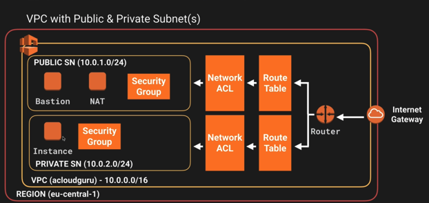

https://help.github.com/articles/basic-writing-and-formatting-syntax/


```no-highlight
Headings
# The largest heading
## The second largest heading
###### The smallest heading
```

#resize image and paste Ctrl+V


>highlight

1. bullets
  - bullet 1
  - bullte 2
    - bullet 3
    - bullet 4
2. bulltes2

**bold**

###Tuesday


~~strike~~



var a = "Tst"


